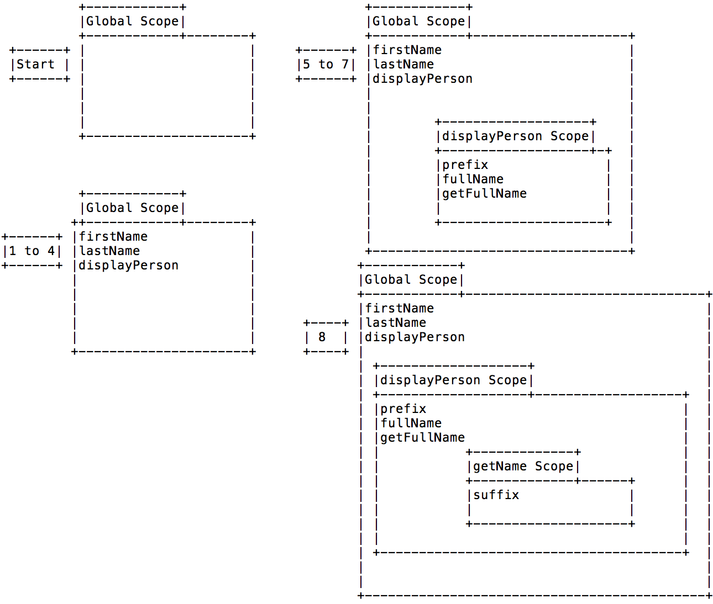
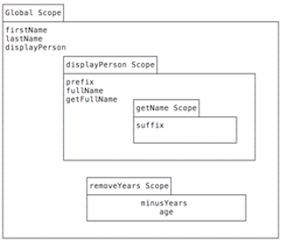

# Scope

## Learning Objectives

- Define 'scope' in the context of programming
- Describe the rules of scope in Javascript
- Describe the impact of hoisting on variable scope

## References

* [Understanding Scope and Context in JavaScript](http://ryanmorr.com/understanding-scope-and-context-in-javascript/)
* [Everything you wanted to know about JavaScript scope](http://toddmotto.com/everything-you-wanted-to-know-about-javascript-scope/)

## Why Scope? Why Now?

>Understanding JavaScript scope is key to writing bulletproof code and being a better developer. You’ll understand where variables/functions are accessible, be able to change the scope of your code’s context and be able to write faster and more maintainable code, as well as debug much faster.

## What is Scope?

In programming, scope is where a variable can be referenced; in other words,
where it can be used.

Another way to think of scopes is that the scope is a list of all variables
that can be accessed from the current line.


## Rules of Scope in JS

In Javascript, there are two types of scope, **global scope** and **local scope**.

There are four simple rules regarding scope in JS:

1. Variables created without the `var` keyword, no matter where in a program,
are placed in the global scope.
2. Variables created *with* the `var` keyword are created in the current local scope.
3. All functions (and only functions) create a new local scope.
4. The current scope includes all outer (enclosing) scopes.

Another way to say this:

* Local variables defined inside a function cannot be accessed from anywhere
outside the function, because the variable is defined only in the scope of the
function.
* However, a function can access all variables and functions defined inside the
scope in which it is defined.

**Note:** One consequence of rule 3 is that variables defined outside of any function are inherently global, even if the `var` keyword is used.

## Examples

### Simple

```js
favoriteAnimal = "Giraffe"  // no var -> global
var favoriteFood = "Tacos"; // global because not in any function

function playBaseball() {
  console.log(favoriteAnimal); // works, globals always in scope
  console.log(favoriteFood);   // works, local variable in outer scope

  pitcherName    = "Jesse Shawl";
  var batterName = "Breece Horper";

  console.log(batterName);  // works, local variable in scope
  console.log(pitcherName); // works, globals always in scope
}

playBaseball()

console.log(favoriteAnimal); // works, globals always in scope
console.log(favoriteFood);   // works, local variable in current scope

console.log(pitcherName); // works, globals always in scope
console.log(batterName);  // DOES NOT WORK, variable is an inner scope

console.dir(window); // note how favoriteAnimal / favoriteFood are properties of window.
```

### More Interesting / Complex

```javascript
var firstName = 'John'; // 1
var lastName = 'Dowd'; // 2
var age = 19; // 3

function displayPerson(fname, lname){ //4, 5
  var prefix = 'Mr'; // 6
  var fullName = null; // 6

  function getFullName(){ // 7
    var suffix = "Esq.";  // Everybody's a lawyer, eh.
    return  fullName = prefix + " " + fname + " " + lname + " " + suffix;
  };

  return getFullName();
};

function removeYears(){ // 8
  var minusYears = 10
  var age = 49;
  return age - minusYears;
};

console.log(displayPerson(firstName, lastName));
console.log(removeYears());

```


* Here's how JS will parse this:

    1. Found 'var firstName' variable declaration.  
    Put firstName variable in Global Scope.  
    2. Found 'var lastName' variable declaration.  
    Put lastName in Global Scope.  
    3. Found 'var age' variable declaration.  
    Put age in Global Scope.  
    4. Found 'var displayPerson' declaration.  
    Put age in displayPerson in Global Scope.

    **Notice that displayPerson's value is a function. So, create a inner scope and process this function.**

    5. Found the fname and lname declarations.
    *Note: functions arguments behave just like local variables.*
    Put them in the displayPerson function scope.  
    6. Found prefix, fullName variable declarations.  
    Put them in the displayPerson function scope.  
    7. Found getFullName declaration.  
    Put getFullName in the displayPerson function scope.

    **Notice that getFullName is a function. So, create an inner scope and  process this function.**
    **All done with getFullName function, no more variable declarations.**
    **All done with displayPerson function, no more variable declarations.**

    

    8. Found removeYears variable declaration.
    Put removeYears in Global scope.  

    **Notice that removeYears value is a function. So, create a inner scope and process this function.**

    9. Found age and minusYears variable declarations.  
    Put these in the function's scope.

    

## Lab.
For the following code enumerate how scope is built and draw a diagram of this scope. *As I have done above*

Work in teams.

Compare the above with another team's deliverable.

```javascript

var autoMake = "Ford";
var autoModel = "LTD";

function showAuto(year){
  function autoInfo(){
    var price = 124;
    console.log("Auto is a " + year + " " + autoMake + " " + autoModel + ", it's price is " + price + "$");
  }

  autoInfo();
};

showAuto(1969);
```


## Sample Quiz Questions

1. Describe the rules of scope in JS.
2. Write an example program that tries to access a variable out of scope.
