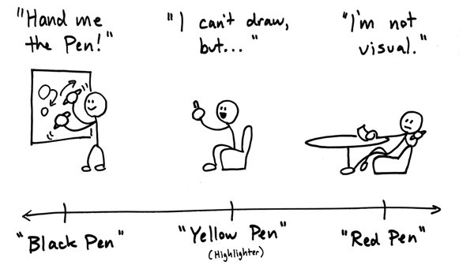

# Problems

> That's why they pay us the big money.

> If the problem was easy, they wouldn't pay us like this.

## Learning Objectives

- Demonstrate how to break a problem into relevant parts
- Demonstrate multiple solutions, identifying tradeoffs
- Indicate what is easily solvable
- Identify areas of high/low risk
-

## The Table Waiter Problem

Let's jump right in.  We'll work on a problem together and then discuss helpful practices and procedures.

Join your squad at a section of whiteboard and solve this problem.  We need a volunteer to record the steps you take and practices you use.

- A waiter has N tables, each with 2-4 guests.
- The waiter makes rounds between each of their tables, the bar, and the kitchen.
- The waiter takes drink orders for a new table, then submits them to the bar.
- Drinks are delivered when all table orders are ready.
- The waiter takes food orders for a new table, then submits them to the kitchen.
- Food is delivered when all table orders are ready.
- The waiter checks idle tables for additional requests, then submits them appropriately.
- Additional requested items are delivered when all table orders are ready.

---

> Q. In one sentence, what problem did you solve?

---

A.  That's probably a good first step right?  This was intentionally open ended.  I bet that one problem you identified is that this isn't just a Table Waiter problem, it's also a group dynamics problem.

---

### Steps ?

> Q. Going around the room, where going to build a list of our steps.  Group 1 provides their step 1, Group 2 provides *their* step 2, and so on.

---

### Synch or Asynch

> Q. Can we just follow these steps in order, top to bottom?

A. No way.  Right?  We have to respond to events.  After I deliver drinks, I need to evaluate the next step, based on some business rules.

### Steps

- clarify the problem
- brainstorm
- organize/select
- prototype
- review
- double down or pivot

---

#### Clarify the problem:
> Seek first to understand, then to be understood. - Steven Covey

Make sure you are solving the right problem.  "Get out of the office" is a phrase often used to remind Founders that they need to get close to their users.  To see the customers using our app in their natural environment.

#### Brainstorm:
> What is now proved was once only imagined. - William Blake

No judgement.  Just ideas.  No lists. No categorization.  Use techniques that get ideas from all types of people; quiet/loud, writers/drawers, analytical/empathetic.  Use colors, crayons, paper, whiteboard.

#### Organize/Select:
> It is not enough to just do your best or work hard. You must know what to work on. - W. Edwards Deming (Father of ideas that made Toyota great, foundation for Lean Manufacturing)

The black pen people grab the pen and run to the board, drawing out their ideas.  The yellow pen people wait, then highlight what's important.  The red pen people wait even longer, then go to the board, cross out and redraw, further clarifying.

#### Prototype:
> Nobody ever got fired for hiring IBM. - the multitudes

Back in the day, IBM's claim to fame was starting 3 "skunk works" for any large project.  After an initial prototype, they would merge members and ideas from the three into one.

Get immediate ROI.

#### Review:
> By three methods we may learn wisdom: First, by reflection, which is noblest; Second, by imitation, which is easiest; and third by experience, which is the bitterest. - Confucius

Retrospectives provide the vehicle for improvement.

#### Double down or pivot:

Finally we need to decide, do we continue down the current path or do we face reality and change direction?

I read about a company that made extremely high quality drill bits.  Competition from overseas, provided bits that were good enough, but much cheaper.  This company realize that they weren't jazzed about drill bits, it was creating holes under exacting specifications.  So they pivoted, to making holes in tough materials, with innovative methods, like hydro-drilling.

---

> There are three principal means of acquiring knowledge... observation of nature, reflection, and experimentation.

> Observation collects facts;

> reflection combines them;

> experimentation verifies the result of that combination.

> Denis Diderot

---

## Practices:

> Q. (3 min) Pick 2 helpful practices and 1 anti-practice.

---

Practices:

- brainstorm
- prototype
- timebox
- change the abtraction level
- paradigm shift
- phone a friend
- simplify
- think outside the box

### Timebox:
> fugit inreparabile tempus - Virgil

> "it escapes, irretrievable time"

Allocate a fixed period of time to each activity.  Make a conscious decision to continue or move on.  This is at all time scales (30 min to weeks).

### Shift Abstraction Level:
> Do not seek to follow in the footsteps of the men of old; seek what they sought. - Matsuo Basho

You can rarely solve a disagreement battling at the level of the problem.  Either go up to ensure you have the same goals.  Or go down to discuss an actual example.

### Paradigm Shift:
> Turn frustration into fascination. - Jim Roan

Look at the problem from a different point of view.  Tackle it from a different direction.

"My flight leaves in 45 minutes. My taxi driver turns around, "The good news is we're only 10 miles from the airport. The bad news? We won't be there for about an hour and a half."  Suddenly I'm... fascinated.  Where are all these people going?  (Nowhere is the only appropriate answer)  Do they sit in this everyday?  Can I make it if I get out an walk?"

### Phone a friend
> Quack

I'm simply amazed at how many issues can be solved by simply sharing your problem.  Often, it gets your brain to provide the answer you need.

### Simplify
> KISS - Gene Simmons

> The key to organization is getting comfortable with your trashcan and your delete key.  - Matt Scilipoti

Simplify.  Simplify.  Reduce.  Cut scope.  Tackle the problem in isolation.

### Think outside the box
> If we weren't all crazy, we would go insane.  - Jimmy Buffet.

Is there some wacky, crazy, no-one would ever do this idea that just might work?  How just something significantly different.  Spend a few moments considering them.

Think about the guy that invented fiberboard, a mix of sawdust and glue.  He bought up all the contracts for collecting sawdust from sawmills.  People paid him to come collect the raw materials for his product.

---

## Exercise:

This time focus on following the provided steps.  Pick an "accountabili-buddy" to hold you to it.

https://github.com/ga-dc/problem_modeling

---

## Suggested Reading

- http://tompeters.com/cool-friends/roam-dan/

## Attributions

- "Rubber duck assisting with debugging" by Tom Morris - Own work. Licensed under CC BY-SA 3.0 via Wikimedia Commons - https://commons.wikimedia.org/wiki/File:Rubber_duck_assisting_with_debugging.jpg#/media/File:Rubber_duck_assisting_with_debugging.jpg
