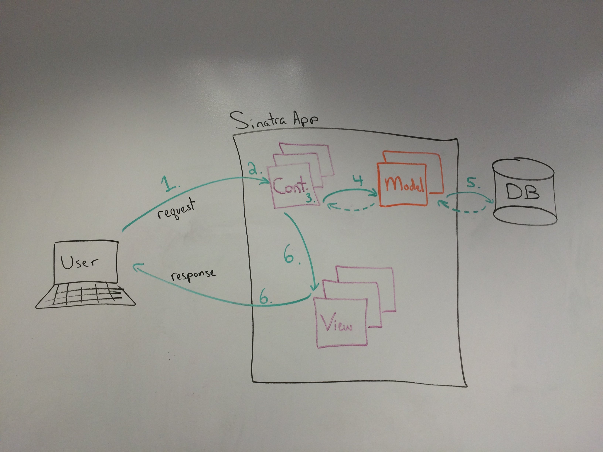

# Sinatra and ActiveRecord

## Learning Objectives

- Explain the role of ActiveRecord in a web app
- Diagram the request / response lifecycle in a Sinatra app with AR
- Load Active Record in a Sinatra app
- Build RESTful routes to implement CRUD functionality in Sinatra
- Write ERB views to display AR models
- Write forms with attributes for ActiveRecord models
- Write forms that use a 'namespace' for parameters
- Use `_method` param to emulate PUT and DELETE requests

## Outline

* Why AR + Sinatra
* Demo Tunr Solution
* Web app request / response diagram (MVC)

## Why ActiveRecord + Sinatra?

Sinatra helps us build simple web applications quickly + easily. But we have no
way to store data. ActiveRecord lets us store data in a DB easily, but has no
web interface (only CLI).

Put the two together, and we can build an app with a *web interface* that is
backed by *data in a database*.

Demonstrate Tunr as an example of this.

## The MVC Paradigm - How Sinatra + AR Work Together

1.  The user makes a request (clicking a link, typing in a URL). **Sinatra** receives the request.
2. **Sinatra** matches the request to the appropriate route (from all the routes we've defined).
3. That route contains a block of code to run in response (**controller** code). This code is written by us, and determines how to handle that request (unique to our app).
4. In most cases, the **controller** will use **ActiveRecord** methods to:
5. create/read/update/destroy data in the **database**.
6. Once the **controller** has done its job (and gotten any data it needs), it renders a **view**, which is sent back to the user (their browser) to be displayed.




## App Organization

For this lesson, we'll be using [Tunr](http://github.com/ga-dc/tunr_sinatra), so go ahead and clone it and change directories into the `tunr` folder.

Here's a summary of the important folders / files in our app. It's important to note that some of these are expected by sinatra (`views`), and the rest are just convention to match Rails.

* **tunr**
  - **db**
    - seeds (sample data)
    - database configuration and connection files
  - **models**
    - classes that inherit from ActiveRecord
  - **controllers**
    - route definitions (`get "/artists" do`)
  - **views**
    - erb templates
    - *layout.erb*
      - a template for every view 
      - calls `yield` (loads another template)
  - **public**
    - static assets
      - JS, CSS, images, fonts
  - *app.rb*
   - the entry point to our application
   - start the application with `ruby app.rb`
  - *console.rb*
    - interact with models and data in the database

## 1. Data Model

We often start building an app by describing the data model. We do this by creating an ERD, defining our schema according to that ERD, loading it into a Database, and then building our ActiveRecord classes (aka models).

#### You Do: ERD

Spend 5 minutes diagramming the ERD for Tunr.

#### You Do: Define the Schema

Using our ERD, fill in `db/schema.sql` with SQL to create the Schema. Look at the readme for a guide to the attributes of each model.

#### You Do: Create the DB & Load the Schema

Create our PostgreSQL database:

`$ createdb tunr_db`

Load the schema:

`$ psql -d tunr_db < db/schema.sql`

#### You Do: Define ActiveRecord Models

Create files for your `Artist` and `Song` classes in the `models` folder.

Remember that the file names should be singular, to match the class name: `models/song.rb`, `models/artist.rb`

#### I Do: Using `console.rb`

We've created a file for you called `console.rb`. Take a minute to read through it and see what it's doing.

This file isn't special, we've just written it so that it loads active record, connects to the database, loads our models, and then gives us a pry console.

We can use `console.rb` to test our AR models without loading up sinatra. It's just for playing around with them.

#### You Do: Play with `console.rb`

Use `console.rb` to create 2 artists, and 4 songs, and associate the songs with artists.

`$ bundle exec ruby console.rb`

#### We Do: Load Seed Data

Take a look at `db/seeds.rb`. We've taken some data from the iTunes API, and formatted it / saved it so we can load it into our database using AR.

Go ahead and run the seed script:
`$ bundle exec ruby db/seeds.rb`

Use the `console.rb` to verify that the data loaded correctly.

## 2. Setting up our sinatra app

*You can proceed with your code, or checkout the `solution_step_1` branch to continue.*

Now that our database / data model is all setup, let's build a web app to let us interact with that data.

To begin, let's set up the main `app.rb` file, which will connect to the database, load our models, and define the homepage route.

#### I do: Setup `app.rb` to load files

Demonstrate using `require_relative` to load connection file:

```ruby
require 'sinatra'
require 'sinatra/reloader'
require 'active_record'

# Load the file to connect to the DB
require_relative 'db/connection.rb'

# Load models
require_relative 'models/artist'
require_relative 'models/song'
```

#### You do: Add the 'home' Route

Create a route for the 'root' or 'home' route, which is a get request to '/'.

It should render an erb file called `home.erb` in views. That view should just have a heading and some info about tunr.

## 3. Add Routes for Artists

*You can proceed with your code, or checkout the `solution_step_2` branch to continue.*

Now that we have the basic structure in place, let's start to put everything together.

Step-by-step, we're going to add the 7 RESTful routes for artists, and the corresponding views. We're also going to use AR to make sure that the data is persisted.

#### I Do: Create the `index` Route

```ruby
# controllers/artists.rb

get '/artists' do
  @artists = Artist.all
  erb :"artists/index"
end
```

#### You Do: Create the `show` Route

#### I Do: Create the `new/create` Routes

```ruby
post '/artists' do
  @artist = Artist.create(params[:artist])
  redirect "/artists/#{@artist.id}"
end
```

#### You Do: Create the `edit/update` Routes

A caveat: to make a `put` request, we need to 'fake it' in our form with a hidden input for the `_method` param:

```html
<form action="/artists/<%= @artist.id %>" method="post">
  <input type="hidden" name="_method" value="put">

  <!-- rest of form here -->

  <input type="submit" value="Create">
</form>
```

#### You Do: Create the `delete` Routes


## 4. Add Routes for Songs

*You can proceed with your code, or checkout the `solution_step_3` branch to continue.*

Now that we have artists, let's add the 7 RESTful routes for songs, and the corresponding views.

For now, just use a text box to let users input the `artist_id` when creating / editing a song.

#### You Do: Create All Seven Routes

## 5. Recap
