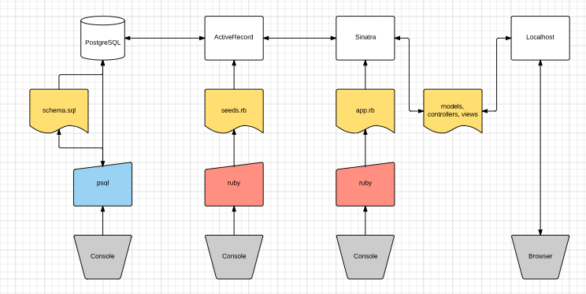

# Troubleshooting Sinatra

## Learning Objectives
- Identify the location of problematic code from an error message
- List common errors made when developing a Sinatra app

## Framing

I made a snappy little temperature-conversion app in Sinatra. Then I went through and broke it in a bunch of places. I tried to cause errors you'd be likely to encounter when developing with Sinatra and Ruby.

We'll walk through it as a class.

[Please download it here.](https://github.com/ga-dc/temperature_converter_refactor)

## Big Pieces of Advice

- `puts` everywhere
  - If that doesn't work, use `binding.pry`
- Make sure Sinatra is running
  - If your app uses a database, make sure the Blue Elephant is running
- Take a breath, and read the error message. What is it actually saying?
  - If you're not sure, it should tell you at least in what file and in what line number the error is located.
- If your Ruby looks good, check the source code in your browser. (`Option` + `Command` + `U` in Chrome.)
  - If you're having stylesheet trouble...
    - ...click on the link to your stylesheet in your source code to make sure it's working.
    - ...make sure the stylesheet is in the `public` folder, and you put a `/` in the `<link>` tag (as in `<link rel="stylesheet" href="/style.css" />`)
    - ...try [validating your CSS](http://jigsaw.w3.org/css-validator/#validate_by_input)
  - If everything looks OK, try [validating your HTML](https://validator.w3.org/#validate_by_input)
- Variables won't show up in your view unless...
  - ...they're inside clown hats with equals signs `<%= @like_this %>`
  - ...if they're defined in your `app.rb`, they're instance variables beginning with `@`
- Do you have `<%= yield %>` in your `layout.erb`?
- Are your views in a `views` folder, and your assets in a `public` folder?
- The only file/directory names that "matter" in Sinatra are the `views` folder, `views/layout.erb`, and the `public` folder. Literally everything else can be named whatever you want it to be.
- Remember that HTML forms only support GET and POST -- not PUT, PATCH, or DELETE. How can you "fake" these requests with a form?

