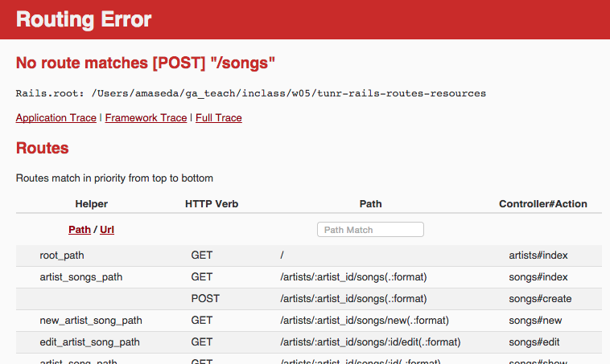

## Learning Objectives (5 / 5)
* Review the relationship between HTTP requests and controller actions.
* Identify the role a router (`routes.rb`) plays in the Rails MVC model.
* Create routes for individual pages in Rails.
* Use resources to define routes for a RESTful controller.
* Use rake routes to display RESTful routes.
* Implement route names in Rails link helpers.
* Implement nested routes in a Rails application.
* Describe how path helpers work for nested routes.
* Implement form_for to build a form for a nested resource.
<br><br>

## The Router (5 / 10)

It's our good ol' friend the Rails rMVC diagram!
* **Q:** Who can walk me through the rMVC pattern, highlighting where the router is and what it does?


The router matches an HTTP request to the corresponding controller action.
* The gateway to the rMVC (router / model / view / controller).
* So something like this `get "/students/2"` is directed to the students controller show route.
* Returns an error if the HTTP request is unrecognizable and/or does not match a controller action.
<br><br>

## Routes (10 / 20)

You guys dove into Rails' `routes.rb` file in Andy's MVC class and create individual routes for pages using Sinatra-like syntax.
* **NOTE:** The `routes.rb` file is located in the `config` folder of your Rails application.

A route to our index page would look like this:
```rb
# index
get "/artists/", to "artists#index"
```

Basically, a simplification of the controller actions in Rails and Sinatra
* **WE DO:** Walk me through writing the route for our `update` -- not `edit` -- method.

```rb
# update
put "/artists/:id", to "artists#update"
```

This would look the exact same for our Song model
* Just replace the model reference in the HTTP request and controller method.

You already took care of this in an earlier class, but we can also define the default route that is triggered when a user visits the home page of our application using the `root` keyword.
* In the below example we direct the user to our artists index page.

```rb
# When we visit http://localhost:3030/, we trigger the index action in our Artists controller
root :to => "artists#index"
```
<br><br>

## Resourceful Routes (5 / 25)

During Adam's class you learned a bit of Rails wizardry that allowed you to generate all of your application's RESTful routes using one word: **resources**!
* Explicitly tells Rails that we will be using RESTful routes.
* Generates path helpers, which we'll look at shortly.

```rb
# This is all we need to generate the RESTful routes for a model
resources :artists
resources :songs

# Even quicker: put them all on a single line
resources :artists, :songs
```

`resources` is Rails' preferred method of RESTfully using the router.
* `resources` assumes by Rails convention that you are using properly named controllers -- in this case, `artists_controller.rb` and `songs_controller.rb` -- and connects our routes -- also properly-named -- to them.
<br><br>

## Rake Routes (10 / 35)

If you're ever confused as to what routes are available to you based on how you have set up your `routes.rb` file, Ruby has a handy tool that tells you.
* Open up your terminal and, in the same folder as your application, type in `rake routes`.

```rb
Prefix      Verb   URI Pattern                 Controller#Action
root        GET    /                           artists#index
songs       GET    /songs(.:format)            songs#index
artists     GET    /artists(.:format)          artists#index
            POST   /artists(.:format)          artists#create
new_artist  GET    /artists/new(.:format)      artists#new
edit_artist GET    /artists/:id/edit(.:format) artists#edit
artist      GET    /artists/:id(.:format)      artists#show
            PATCH  /artists/:id(.:format)      artists#update
            PUT    /artists/:id(.:format)      artists#update
            DELETE /artists/:id(.:format)      artists#destroy
            GET    /songs(.:format)            songs#index
            POST   /songs(.:format)            songs#create
new_song    GET    /songs/new(.:format)        songs#new
edit_song   GET    /songs/:id/edit(.:format)   songs#edit
song        GET    /songs/:id(.:format)        songs#show
            PATCH  /songs/:id(.:format)        songs#update
            PUT    /songs/:id(.:format)        songs#update
            DELETE /songs/:id(.:format)        songs#destroy
```

You've seen most of this information before: HTTP request verbs, routes and controller actions.
* Path helpers are new, at least from what we learned in Sinatra. You started to learn about them during Adam's helpers class.
<br><br>

### Path Helpers  
**Q:** Can somebody remind me what helpers are and how path helpers fit into that category?
* **Helpers** make our lives easier and save us the trouble of writing out long, repetitive code.
* **Path helpers** are references to routes and controller actions.

Path helpers vary between routes
* `index`: `artists_path`
* **Q:** What about the path helper `edit`? How is it different from `index`?
  * Takes an object as an argument.
    * `artists_path( some_artist )    # "/artists/:id/edit"`
* **WHEN DO NON-NESTED PATH HELPERS TAKE ARGUMENTS (e.g., songs#show view edit link, artists#show view edit link)**

Only four path helpers for each model.
* Some paths can be used for multiple routes (e.g., `artist_path` covers `artists#show` `#update` and `#destroy`). Their purpose depends on context.
<br><br>

## Routes and Helpers (5 / 40)

With path helpers, we can tidy up the other helpers you guys have alrady implemented in Tunr.
* Q: What sort of helpers have we already encountered this week?
<br><br>

### Link Helpers

```rb
# views/artists/index.html.erb

# From this...
<h2>Artists <a href="/artists/new">(+)</a></h2>
```

```rb
# ...to this
<h2>Artists <%= link_to "(+)", new_artist_path %></h2>
```
<br><br>

### Form Helpers

```rb
# views/artists/new.html.erb

# From this...
<form method="post" action="/artists">
  <input type="hidden" name="authenticity_token" value="<%= form_authenticity_token %>">

  <label>Name</label>
  <input type="text" name="artist[name]">

  <label>Photo Url</label>
  <input type="text" name="artist[photo_url]">

  <label>Nationality</label>
  <input type="text" name="artist[nationality]">

  <input type="submit" value="Create Artist">
</form>
```

```html
# ...to this
<%= form_for @artist do |f| %>
  <%= f.label :name %>
  <%= f.text_field :name %>

  <%= f.label :photo_url %>
  <%= f.text_field :photo_url %>

  <%= f.label :nationality %>
  <%= f.text_field :nationality %>

  <%= f.submit %>
```
<br><br>

## Nested Resources (15 / 55)
The way our app is currently routed isn't too helpful, right?
* We want our Songs to exist in the context of a parent Artist.
* Currently we can visit an artist show page, which includes a link of all that artist's songs.
* But we want to be able to visit a URL like this: `http://www.tu.nr/3/songs/`
* This is where nested resources come in...

Let's update our router...

```rb
# Going from this...
resources :artists, :songs

# ...to this.
resources :artists do
  resources :songs
end
```

Say we want to list all the Songs by a given Artist. That index route will look something like this...

```rb
# songs#index
get "/artists/:id/songs" to "songs#index"
```

And our show route will look something like this...

```rb
# songs#show
get "/artists/:id/songs/:id" to "songs#show"
```

**Q:** What do you think of these routes? Do you notice anything wrong with them?
* Um, `:id` is used twice. What if they have different values?
* Exactly! So our routes are going to look something more like this...

```rb
# We rename the first :id to :artist_id to make clear that it is the :id number of the Artist in question.
get "/artists/:artist_id/songs" to "songs#index"
get "/artists/:artist_id/songs/:id" to "songs#show"
```
<br><br>

**WE DO:** What do you think the route for our Song create method would look like?

```rb
post "/artists/:artist_id/songs" to "songs#create"
```
<br><br>

**YOU DO:** Spend the next 5 minutes writing out the individual routes for our nested resources model.
* We will not be replacing our resources statements in the `routes.rb` file with this.
* **DO NOT** check our answers with `rake routes` quite yet...
<br><br>

## BREAK (10 / 65)
<br><br>

## Let's implement nested routes in Tunr! (60 / 125)

Okay, so our `routes.rb` file is updated with nested resources. Let's see them in action and fire up our Tunr app!

### Uh oh. It broke...


That's okay. You're going to spend the next hour fixing it!
* Spend 5 minutes looking through your application and think about what we need to change in order to accommodate our new routing system.
* Don't worry about solving the problem immediately. Start by identifying things we need to change.


### Bonuses
If you find yourself moving along faster than my pace, try implementing the following...
* A third model for Genre that has a `belongs_to` relationship with Artists.
* There are also some advanced topics included in "Additional Reading" at the bottom of the lesson plan.
<br><br>

### Let's look at `rake routes` again...
Has anything changed?
* Our HTTP requests (URI Pattern) match the individual nested routes we just talked about (e.g., `:artist_id`).
* Our Song path helpers are now prefixed with artist (e.g., `artist_songs`, `new_artist_song`).
* Our controller actions are the same.
  * **Q:** Are we going to need to change anything in our controllers?

```rb
Prefix            Verb   URI Pattern                                  Controller#Action
root              GET    /                                            artists#index
songs             GET    /songs(.:format)                             songs#index
artist_songs      GET    /artists/:artist_id/songs(.:format)          songs#index
                  POST   /artists/:artist_id/songs(.:format)          songs#create
new_artist_song   GET    /artists/:artist_id/songs/new(.:format)      songs#new
edit_artist_song  GET    /artists/:artist_id/songs/:id/edit(.:format) songs#edit
artist_song       GET    /artists/:artist_id/songs/:id(.:format)      songs#show
                  PATCH  /artists/:artist_id/songs/:id(.:format)      songs#update
                  PUT    /artists/:artist_id/songs/:id(.:format)      songs#update
                  DELETE /artists/:artist_id/songs/:id(.:format)      songs#destroy
artists           GET    /artists(.:format)                           artists#index
                  POST   /artists(.:format)                           artists#create
new_artist        GET    /artists/new(.:format)                       artists#new
edit_artist       GET    /artists/:id/edit(.:format)                  artists#edit
artist            GET    /artists/:id(.:format)                       artists#show
                  PATCH  /artists/:id(.:format)                       artists#update
                  PUT    /artists/:id(.:format)                       artists#update
                  DELETE /artists/:id(.:format)                       artists#destroy
```

Having seen this, let's make a To-Do list of things to change in our Rails app so that we can successfully use nested resources.  
  1. Link Helpers  
  2. Form Helpers  
  3. Songs Controller  
  <br><br>

### Let's take another look at that error...


Our application doesn't seem to like the `songs_path` in our `application.html.erb` left over from our former life as a non-nested-resource application.

```erb
# /views/layouts/application.html.erb

<nav>
    <%= link_to "Songs", songs_path %>
    <%= link_to "Artists", artists_path %>
</nav>
```

This link would normally take us to a list of all the songs in our database.
* I think we should keep this route!
* We're going to cheat a little bit and preserve this non-nested route by making a change in `routes.rb`.

```rb
# config/routes.rb

Rails.application.routes.draw do
  root to: 'artists#index'

  resources :artists do
    resources :songs
  end

  # We're creating non-nested resources for Song, but only allowing the index controller action
  resources :songs, only: :index
end
```

If we enter `rake routes` into our terminal again, you'll notice that `songs_path` now appears at the bottom of the list.
* If we try refreshing our home page again, it should work!
* This is the only exception to nested resources that we'll be using in Tunr.
* If you click on the "Songs" link, it won't work. Don't worry about that for now.
<br><br>

### Let's click on an artist...

Another error! What went wrong this time?


Our app does not like the `new_song_path` we used in a link helper in our `artists/show.html.erb` file.

```html
# /views/artists/show.html.erb

<h3>Songs <%= link_to "(+)", new_song_path %></h3>
```

What do we need to replace this path helper with?
* **HINT:** Look at `rake routes`!

```html
# /views/artists/show.html.erb

<h3>Songs <%= link_to "(+)", new_artist_song_path %></h3>
```

By nesting resources, `new_song_path` became `new_artist_song_path` since every song we create is now created in the context of an artist.
* But our app is still giving us an error. WHY?!
<br><br>


You'll notice that we're getting a different error this time that ends with: `missing required keys: [:artist_id]`
* **Q:** Does anybody know what else we have to do to our link helper to fix this?

```html
# /views/artists/show.html.erb

# Feed @artist as an argument to the path helper
<h3>Songs <%= link_to "(+)", new_artist_song_path( @artist ) %></h3>
```

We need to feed our `new_artist_song_path` helper an artist as a variable.
* Now our app knows which artist it is rendering a new song form for.

And that'll do it. Let's refresh our page...
<br><br>


So now what? The link helper for an individual song inside of our .each enumerator isn't working.

```html
# /views/artists/show.html.erb

<ul>
  <% @artist.songs.each do |song| %>
    <li>
      <%= link_to "#{song.title} (#{song.album})", song %>
    </li>
  <% end %>
</ul>
```
<br><br>

**WE DO:** Help me out with this one.
* We don't have a path helper at the moment. What page are we trying to link to?
* So which path helper do we need to add?
* Do we need to feed it a variable? If so, how many?

```html
# Feed the path helper an argument for @artist
# As well as songs, since each link goes to a particular song
# We use the iteration variable for song since we're in an enumerator
<ul>
  <% @artist.songs.each do |song| %>
    <li>
      <%= link_to "#{song.title} (#{song.album})", artist_song_path( @artist, song ) %>
    </li>
  <% end %>
</ul>
```
<br><br>

**YOU DO:** From an artist show page, click on a song. You should get an error.
* I want you to try fixing the `songs/show.html.erb` file.
* **HINT:** You might have to add an instance variable to `songs_controller.rb`.
  * Remember, our song routes don't look the same as they did before!
* I'll check in after 5 minutes.
<br><br>

### Form Helpers

Something else we'll need to change are forms. Let's try making a new song.
* From an artist show page, click on the "(+)" next to "Songs".

No immediate error! But it's not working quite yet. Let's try creating a song.



So the error isn't as specific as the ones we've already encountered, but it looks like our application is trying to post to a `/songs` route.
* Our application does not support that particular route and controller action.
* Let's take a look at `songs/new.html.erb` and `songs_controller.rb` and see what we need to fix it...

```html
# /views/songs/new.html.erb

<%= form_for @song do |f| %>
  # form contents
<% end %>
```

```rb
# /controllers/songs_controller.rb

# new
def new
  @song = Song.new
end
```

We need to associate each new song with an artist. To do that, we need to provide our `form_for` helpers with both an artist and song as arguments.
* That means we first need to define the artist in question in our controller action. Then we can modify our form.

```rb
# /controllers/songs_controller.rb

# new
def new
  @artist = Artist.find(params[:artist_id])
  @song = Song.new
end
```

Now let's modify our form.
* When feeding multiple arguments to `form_for`, we have to place them inside of an array.
* In this case, we're not only giving it a new song (via `@song`) but also the artist we'll be adding it to (via `@artist`).

```html
# /views/songs/new.html.erb

<%= form_for [@artist, @song] do |f| %>
  # form contents
<% end %>
```
<br><br>

**WE DO:** So that takes care of the form. Now we need to fix the `create` controller action in `songs_controller.rb` so that we can add songs to artists!
  * We need an artist to add a song to, right? How do we set that up.
  * How should we modify `@song` so that it's saved to the proper artist?
  * Where would it make most sense to redirect to? Let's try the artist show page -- what path should be use?

```rb
# /controllers/songs_controller.rb

# create
def create
  @artist = Artist.find(params[:artist_id])
  @song = @artist.songs.create(song_params)

  redirect_to artist_path(@artist)
end
```
<br><br>

**YOU DO:** Now you do the rest! It seems pretty daunting, I know, but you won't have to change anything beyond link helpers, form helpers and controller actions.
* If you feel lost, follow the error.
* Strongly encourage you to work with each other on this.
* Me and the support instructor are also here to help.
<br><br>

## BREAK (10 / 135)
<br><br>

## Additional (Optional) Reading
* [Rails Routing From The Outside In](http://guides.rubyonrails.org/routing.html)
* [The Lowdown On Routes](https://blog.engineyard.com/2010/the-lowdown-on-routes-in-rails-3)
* [Scoping Rails Routes](http://notahat.com/2014/02/05/scoping-rails-routes.html)
<br><br>

## Homework (15 / 150)
[Add nested resources to your Blog!](https://github.com/ga-dc/scribble#routes)

Spend the remaining class-time either working on your homework or you can ask me questions on anything you've learned this week.
<br><br>

## Sample Quiz Questions
