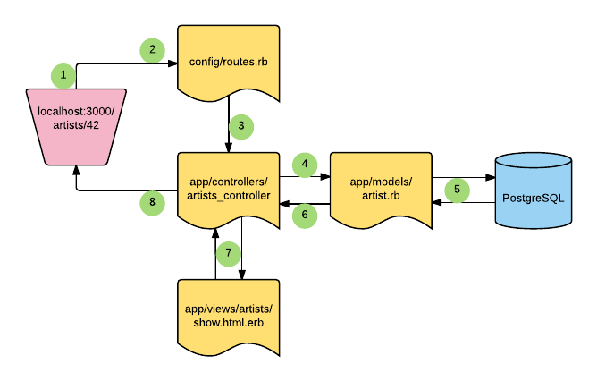

# Views and Controllers

## Learning Objectives
- Describe the roles of controllers and views in a Rails app
- Explain how the router directs requests to a specific controller and action
- Explain how controller actions map to specific views
- Describe the Rails convention for implicitly rendering a view from an action
- Use `strong_params` to limit what attributes can be modified
- Describe the role of instance variables in sharing information between an action and its view
- Differentiate between `redirect` and  `render`

## Opening Framing (5/5)
Last week, you got a quick overview of the full MVC structure of a Rails app by porting Tunr from Sinatra into Rails.

As a quick review: **(ST-WG):** Why is the MVC structure so important?

> Interesting to note, the early MVC artchitects layed the foundational building blocks paving the way for the launch of GUI programming: [MVC History](https://en.wikipedia.org/wiki/Model%E2%80%93view%E2%80%93controller#History)

Today, we're going to continue the deeper dive into the why and how of "The Rails Way" for each of the major components of the MVC structure.

 The M, Models & Migrations gave us a systematic,iterable way to organize, store, retrieve, and modify a database, using ActiveRecord as an interface to map our database tables into objects in Ruby.

 Views & Controllers will build on that, allowing us to do more with that structured data. But what..?

### Doc Dive (5/10)
Read Parts 1-3: http://guides.rubyonrails.org/action_controller_overview.html

### Turn & Talk (5/15)
With a partner, discuss:
1. What is the role of a controller in a Rails application?
2. What are the conventions for naming Rails controllers?
3. What are the benefits following the 'Rails Way'?

### rMVC: Revisited (10/25)
The design pattern that rails is built around is rMVC - Router, Model, View and Controller.



**Question:** Who can remind us what the role of a view is in a Rails application?

Life Cycle of a request/response in Rails:

1. A user of our web application submits a request to our application's server. It can come in a myriad of ways. Maybe someone typing in a URL and hitting enter or maybe a user submitting a form on our application.

2. The request hits the router of the application.

3. The application than either doesn't recognize the route (error) or it does recognize it(route) and sends it to a controller.

4. Once the request hits the controller, its then going to query the database through Active Record(the model) for the information specified in the controller.

5. Once the controller has the information from the model that it needs it sends it to the view

6. The view takes the objects from the controller and sends a response to the user.

Let's dive into an example, and see MVC in action by writing some rails code.

## Set-Up (5/30)
This lesson will build directly off of the work you did with Models and Migrations.

If you would prefer to work with a clean starter rather than building on your existing copy:

```bash
git clone git@github.com:ga-dc/tunr_rails_models_and_migrations.git
cd tunr_rails_models_and_migrations
git checkout views-controllers-starter
git checkout -b inclass
```
Make sure to remember to run:
```
bundle install
rake db:create
# ^Only if you do not have a tunr_db database
rake db:migrate
```
Make sure to seed the db if you haven not already.

A good place to start reviewing our code base so far, in any rails app, is our application's routes.

## Route-Controller-Action Relationship (10/40)
Make sure you are in the applications directory and in your terminal run:
 `$ rake routes`

```bash
Prefix      Verb   URI Pattern                 Controller#Action
    artists GET    /artists(.:format)          artists#index
artists_new GET    /artists/new(.:format)      artists#new
            POST   /artists(.:format)          artists#create
            GET    /artists/:id(.:format)      artists#show
            GET    /artists/:id/edit(.:format) artists#edit
            PUT    /artists/:id(.:format)      artists#update
            DELETE /artists/:id(.:format)      artists#destroy
```
Rake routes allows us at any time to view the current routes of this app and see the controller actions mapped to each route.

For example, let's look at the request/response life cycle of a get request hitting the artists index action.

When a user visits: `http:localhost:3000/artists`

- The user types in a url, which triggers a request to the server. It hits the router. The router says, "a GET request to the '/artists' path? No problem! Hey, artists controller, you need to perform the index action"

- The artists controller says, "An index action? I've got one of those. Lets see, it says here I need to ask the model for information about all of the artists. Hey, ActiveRecord Model, gimme that data!"

- Thanks for all the artists, Now I'm going to send all this information to the view. The view than generates a response to the client.

Let's write the code to make this response a reality.

## WE-Do: Define an Index Action and View (15/55)
We need to first create a controller for our artists. In your terminal:

```bash
 $ touch app/controllers/artists_controller.rb
```
> **Note** the convention for naming this file: plural resource name, snake_case

In that file, let's define our controller

```ruby
# in app/controllers/artists_controller.rb
class ArtistsController < ApplicationController
  # actions will go here
end
```

Great, now that we have a new controller for artists, let's go over what we want to include in our controller.

Recalling from our routes, there are 7 RESTful calls that the router has mapped to our `artists_controller` actions.

Right now we know our controller is pretty blank, but let's fire up our server:

```bash
$ rails s # short for rails server
```
and in our browser, visit the route to view all artists:

`http://localhost:3000/artists`

What do we see?
<br>


When we go to `http://localhost:3000/artists` our router says it knows where to send it. It's sending it to the artists controller and expects it to do the index action. Unfortunately we haven't defined it yet, so it's unknown. Let's go ahead and define that action now

In `app/controllers/artists_controller.rb`:

```ruby
class ArtistsController < ApplicationController

  def index

  end
end
```

> In rails methods defined in our controllers are known as `actions`

Great let's reload:


Another error... We'll get more into this later. But this one is yelling at us for not having a view(template) yet. Specifically in this case, the index view. So let's create that. Let's first make a directory and file in the terminal:

```bash
$ mkdir app/views/artists
$ touch app/views/artists/index.html.erb
```

> Note the conventions here. We needed to make an `artists` folder to put the `index.html.erb` in it. This is important because when we define an `action` in our controller, rails knows to render the view corresponding to the controller and action. In this example, because were calling the `index` action in the `artists_controller`, it'll look for the `index` view in the `artists` folder.

Inside `app/views/artist/index.html.erb`:
Just put: `<h1>All Artists</h1>`

Great, now let's refresh the page and there should be no more errors so we know everything has been wired up correctly!

However, let's think about what we really want to see when we visit this page. When we visit `/artists`, we expect to see information about all artists!

So now the question is how can we dynamically generate a view for all of our data about artists?

### Instance Variables
Recall from our Sinatra lessons how we used instance variables in our controllers.

**Question:** What is the importance of instance variables in controller actions?

We use instance variables in our controller actions, so we can have programmatic access to variables inside of our views. More often than not these instance variables will contain objects from the database.

Let's use our friend Active Record to query our database for all artists and save that to an instance variable.

In the index action:
```ruby
def index
  @artists = Artist.all
end
```

Now, in our index view, we have programmatic access to the variable `@artists`!

> It should be noted that while we practice a separation of concerns we aren't just limited to querying for only artists in the artists controller. Additionally, we can store just about anything we could have normally stored in a ruby variable.

Let's write some code in our view to display this data.

In our `app/views/artists/index.html.erb`
```html
<h1>Artists <a href="/artists/new">(+)</a></h1>

<ul>
  <% @artists.each do |artist| %>
    <li>
      <a href="/artists/<%= artist.id %>">
        <%= artist.name %>
      </a>
    </li>
  <% end %>
</ul>
```

Now when we visit `/artists` in the browser, we see a list (index) of all artists. We have included links to the new page, and for the show page, but we haven't created those yet so....

### You-Do: Show and New Actions (15/70)
- Define `show`, and `new` controller actions for artists
- Create `show`, and `new` views for artists
- Display relevant info for an artist when you visit their show page
- When you visit the `new` page, the relevant form should be displayed
- Don't worry about submitting the form just yet

## BREAK (10/80)

## WE-DO: Artists Create Action (20/100)
So at this point we have a way to see all artists, view info about a specific artist, as well as see a form to add a new artist.

```rb
<form action="/artists" method="post" >
  <label for="name">Name:</label>
  <input name="name">

  <label for="photo_url">Photo URL:</label>
  <input name="photo_url">

  <label for="nationality">Nationality:</label>
  <input name="nationality">

  <input type="submit" value="Create">
</form>
```

But what happens when we try to submit this form?

If we were looking in our browser, we would get our old friend `unkown action` error, saying:
`The action 'create' could not be found for ArtistsController`

Let's write that action for our controller and get this form to work.

In `app/controllers/artists_controller.rb`:

```ruby
# Artists#Create
def create
  @artist = Artist.create!(name: params[:name], nationality: params[:nationality], photo_url: params[:photo_url])
end
 ```

With this action, we want to create an instance using the params the user entered into the form, and we also set up a check  to see whether or not the model was stored in our database.

When the request completes, we now need to worry about where to direct the user after adding a new artist.

### Authenticity Tokens

Let's go to our form in our browser at `http:localhost:3000/artists/new` and try to add an artist.

What happens?

```
# ERROR!
# ActionController::InvalidAuthenticityToken in ArtistsController#create
```

What's going on here?

Rails is setup such that it doesn't allow just any parameters to be accompanied by a request. This is why we had to do some additional configuration changes to get our Sinatra forms to work.

How to do we solve this?

Any time a user views a form to create, update or destroy a resource, the rails app creates a random `authenticity_token` and stores it in a session. When the user than submits the form, rails will look for the `authenticity_token` compares it to the one stored in the session, and if they match, allow the request to continue.

If someone was trying to update our database in some way other than our application, it would be denied.

The first thing that I want do is add the authenticity_token in our `new` form.

Add the hidden input field that contains the auth token in `app/views/artists/new.html.erb':

```html
<form action="/artists" method="post" >
  <input type="hidden" name="authenticity_token" value="<%= form_authenticity_token %>">
  ... more form code
```

Great, so now that we added an random authenticity_token to each request as an extra layer of security, we should be good to go right?!

### Render vs Redirect (5/105)
Like Sinatra, Rails has many ways to map our app's logic navigating a user's request to a response they care about.

For example, taking a closer look at index action of our Artists Controller:

```ruby
def index
  @artists = Artist.all
end
```

**Question:** How did we see the artists index view page, when we went to our index route?

If we remember back to Sinatra, you'll notice that we're not explicitly telling the application which view file to render.

That's because rails has implicit rendering. Basically rails is smart enough to know if the artists controller action is called index, then it will look for the index view in the artist folder.

You can explicitly change the implicit render by calling the `render` method in the action of a controller. Something like this:

```ruby
def index
  @artists = Artist.all
  render :index
end
```

You could also redirect rather than render. **(ST-WG):** What are the differences between redirecting and rendering?

## (I-DO) Sanitization/Strong Params (10/115)
Looking at the code for the `artists#create` method, we find this line:

```rb
  @artist = Artist.create!(name: params[:name], nationality: params[:nationality], photo_url: params[:photo_url])
```

We're only submitting 3 fields so that's not so bad, but if we were submitting 50 fields that would mean we have to write a HUGE line.

If only there was some way to not have to do that!

Instead of one argument for each field in a record, `.create` can actually take one argument in total that is a hash of all the fields that should be updated. For instance:

```rb
@artist = Artist.create!({
  name: "John",
  nationality: "German",
  photo_url: "http://image.com/john.jpg"
})
```

That by itself doesn't do us any good. But what if we could have our HTML form package up all the artist data into one `params` field? Then, we could just use something like:

```rb
  @artist = Artist.create!(params[:artist])
```

Change the HTML of your form `app/views/artists/new.html.erb` to this:

```html
<form action="/artists" method="post" >
  <input type="hidden" name="authenticity_token" value="<%= form_authenticity_token %>">
  <label for="name">Name:</label>
  <input name="artist[name]">

  <label for="photo_url">Photo URL:</label>
  <input name="artist[photo_url]">

  <label for="nationality">Nationality:</label>
  <input name="artist[nationality]">

  <input type="submit" value="Create">
</form>
```

It important to notice the input's name space following `artist[attribute]` patterns. This is important for how we can access the arguments passed by the user in the global `params` object.

[More about Rails' Params](http://stackoverflow.com/questions/6885990/rails-params-explained)

If you submit the form now, and check the console, you should see something like:

```
{
    "authenticity_token"=>"I04y1td+X5CIiVdZ50ABEGAy6f0LCJReSDa5eq5/GvXICDkUpeu2peCt/BlPHmU1VSadWvzXUy/9uyNixjrP+A==",
    "artist"=>{
        "name"=>"John",
        "photo_url"=>"http://images.google.com/john.jpg",
        "nationality"=>"German"
    }
}
```

That's all the data that was submitted with the form. Notice all of the artist's data is now inside its own hash **inside** the params hash.

Update the controller to receive that param:

```rb
def create
  @artist = Artist.create!(params[:artist])
end
```

However, in the browser, you get:

```
# ERROR!!!
# ActiveModel::ForbiddenAttributesError in ArtistsController#create
```

Wat?! Why can't we create an `artist` using the hash available in params? This is a security feature of Rails: `params` could include extra fields that have been maliciously added to the form. This extra data could be harmful, therefore Rails requires us to whitelist fields that are allowed through form submissions.

### Strong Params

Whitelisting is done using **strong parameters** configuration!

This is a security feature of Rails: params could include extra fields that have been maliciously added to the form. This extra data could be harmful, therefore Rails requires us to whitelist fields that are allowed through form submissions.

Now we should update our Artists controller a bit.

First let's create a private method that will allow us to pull information from the form.

in `app/controllers/artists_controller.rb`:
```ruby
private
def artist_params
  params.require(:artist).permit(:name, :photo_url, :nationality)
end
```

> The `require` method ensures that a specific parameter is present. Throws an error otherwise. The `permit` method returns a copy of the parameters object, returning only the permitted keys and values.

> **Note** that we encapsulate the `artist_params` in a private method because we only want this available to this particular class and it shouldn't work outside the scope of the controller

The only thing we have left to do is update our controller actions that use params to create or update an artist.

in `app/controllers/artists_controller.rb`:

```ruby
#### before
def create
  @artist = Artist.create!(params[:artist])
  redirect_to "/artists/#{@artist.id}"
end

#### after  
def create
  @artist = Artist.create!(artist_params)
  redirect_to "/artists/#{@artist.id}"
end
```

Great, now we're protected!

## Break (10/125)

## You-Do: (20/145)
- Define `edit`, `update` and `destroy` controller actions.
- Create an `edit` view file.
- When you visit the `edit` page, the relevant form should be displayed
- Upon submitting the form, artist info updates accordingly.
- Create a way to destroy an artist

## Bonus: Songs
- Define 7 RESTful routes and map to appropriate songs controller actions.
- Create a songs controller
- Define 7 CRUD actions
- Create appropriate view files

## Closing (5/150)

Who can remind us of the importance of a controller?
How does the view access data?
What is the difference between render and redirect?
How does strong params protect us from malicious input?

## Resources
- [Rails Guides: Controllers](http://guides.rubyonrails.org/action_controller_overview.html)
- [Rails Guides: Views and Templates](http://guides.rubyonrails.org/layouts_and_rendering.html)
- [Michael Hartl's Rails Tutorial](https://www.railstutorial.org/book)
