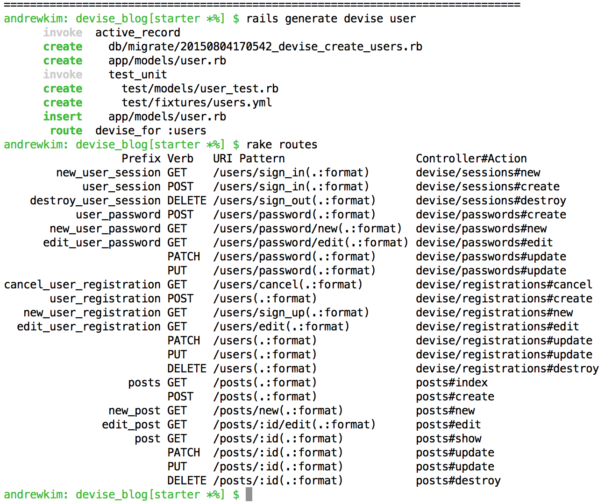

# Devise

## Learning Objectives
- implement user authentication into a web application utilizing the devise gem
- implement useful helper methods devise provides

## Opening Framing (5/5)

We learned how to do User authentication the hand rolled way. Turns out, lots of folks were doing the same thing over and over again for user authentication so they devised a solution... the devise gem. In rails, we use it to streamline user authentication. We're going to talk about how to get devise running and a couple of helper methods. This lesson will just scratch the surface of what devise has to offer, but it will give you a good handle on a simpler way to do user authentication.

## SETUP (10/15)

Go ahead and fork/clone [this repo](https://github.com/ga-dc/devise_blog/tree/starter)

Run the normal commands in the terminal:

```bash
$ bundle install
$ rake db:create db:migrate db:seed
```

What we have here is a basic single Model CRUD application. Much like scribble but without comments. You can type in `$ rake routes` into the terminal to see what all the available routes are. If you run rails server and look around the site you can see there's full CRUD for our Post model.

## Devise -setup (15/30)

Let's start integrating devise into our application. The first thing I should do is add `devise` to the `Gemfile` in our rails main directory.

```ruby
gem 'devise'
```

Next I'm going to run some commands in the terminal that installs devise and generates a bunch of stuff for us.

> Note things followed by `#` are comments for the terminal inputs.

In the terminal in our rails main directory:

```bash
# normal bundle install
$ bundle install

# install devise
$ rails generate devise:install

# generator for user auth
$ rails generate devise user
```

This is some of the stuff that it's given us:



> Take a look at the devise source code! and you can see all of the different controllers


Its alot but of stuff to look at, but let's break it down. Going from top to bottom excluding some of the files we won't be using for this class.

The first thing that was created was a migration for this model. In `db/migrate/<somedate>_devise_create_users.rb` there's alot of information here, but I think most pertinent to us in the scope of user auth is the email and password attributes.

The next thing that I see is a model defintion was created for us in `app/model/user.rb`:

```ruby
class User < ActiveRecord::Base
  # Include default devise modules. Others available are:
  # :confirmable, :lockable, :timeoutable and :omniauthable
  devise :database_authenticatable, :registerable,
         :recoverable, :rememberable, :trackable, :validatable
end

```

> the different arguments being passed in to devise are very semantically named as far as their utilities go.

The next thing that was added was `devise_for :users` in our `config/routes.rb`

That one line of code opens routes to alot of devise user authentication controller actions


## Devise -configuration(15/45)
add this to `config/environments/development.rb`:

```ruby
 config.action_mailer.default_url_options = { host: 'localhost', port: 3000 }
 ```
> In an email there is no context for host and port where as other urls are relative and don't need explicit host and port

 I think it'd be nice we just went ahead and added a logout button to the layout so that we can easily log in and log out as a user. So in our `app/views/layouts/application.html.erb` add the following code:


 ```html
<% if current_user %>
  <h3><%= link_to 'Signout', destroy_user_session_path, :method => :delete %></h3>
<% else %>
  <h3><%= link_to 'Signup', new_user_registration_path %></h3>
  <h3><%= link_to 'Login', new_user_session_path %></h3>
<% end %>
```
> current_user is a helper method that allows us to access the user if one is logged in. If they are logged in, the signout link will appear, if not both the signup and login link will appear.


Let's also add a root path to our `config/routes.rb`:

```ruby
root 'posts#index'
```

## Devise Helpers (15/60)

Let's go ahead and fire up our server `$rails s` and sign up for our site!

Welcome aboard! You're an authenticated rider on rails! What does that really mean though?

(ST-WG) What's fundamentally different about our application than before? ..

So we've signed up and can see that nothing really has changed, we can still access our posts like normal.

Let's add a bit of code too see if we can garner some more functionality.

The first thing that I want to do is add the helper method `authenticate_user!` in the index action of the posts controller. So inside `app/controllers/posts_controller.rb`:

```ruby
def index
  authenticate_user!
  @posts = Post.all
end
```

You'll notice now, if i'm not logged in, i can no longer access the index action and it redirects me to the signup page if i try to access this action. This is really cool. I now have a way to restrict controller actions unless people are logged in.

This sort of thing is common with alot of actions or all actions of a controller. So we can use a `before_action` callback to handle this. Let's get rid of the `authenticate_user!` in the index action and put the following code at the top of `app/controllers/posts_controller.rb`:

```ruby
class PostsController < ApplicationController
  before_action :set_post, only: [:show, :edit, :update, :destroy]
  before_action :authenticate_user!, only: [:create, :edit, :update, :destroy]
  def index
     # ... more code follows
```

> note I only want to authenticate the user for the create edit update and destroy actions, it doesn't matter to me who is able to view posts. Though this is totally dependent upon the domain model.

We saw `current_user` above earlier. But we only took advantage of its truthiness/falsiness to generate some links for us. I think more importantly though, `current_user` is a helper method that returns a ruby object in our database that represents the user that is logged in.

To illustrate this more effectively. Let's add a bit of functionality. What I want to achieve is for users to be able to have many posts and for posts to belong to a user.

Let's do the following:
- add `has_many` and `belongs_to` associations in our model definitions
- add a foreign key to our posts table /w migration (`rails g migration add_foreign_key_to_posts user_id:integer`)
- `$ rake db:migrate`
- in the index action, change `@posts = Post.all` to `@posts = current_user.posts`
> note that since we don't have the `authenticate_user!` helper on the index action, if we were to access posts directly without authenticating it would error out. So to fix that we should enter some if/else conditional to handle this.

- in the create action , change `@post = Post.new(post_params)` to `@post = current_user.posts.build(post_params)`
> So we aren't able use new on the posts helper method. `.build` is the equivalent of `.new`. `.create` is the the same when using has_many helper getters. Additionally when we `.build` or `.create` we don't have to pass in the foreign_key or object in as an argument because we're "building" or "creating" off of that object.

## What you can look forward to with devise! (Should you want to learn more on your own, or if we have extra time I can talk about devise views a little bit.)

[Devise Documentation](https://github.com/plataformatec/devise)

This documentation contains alot of great information.

- Customize devise views
- Customize devise model attributes [Direct Link to Docs](https://github.com/plataformatec/devise#strong-parameters)

If you want to add devise to a brand new rails application check out this [blog post](http://andrewsunglaekim.github.io/Getting-a-handle-on-devise/)
