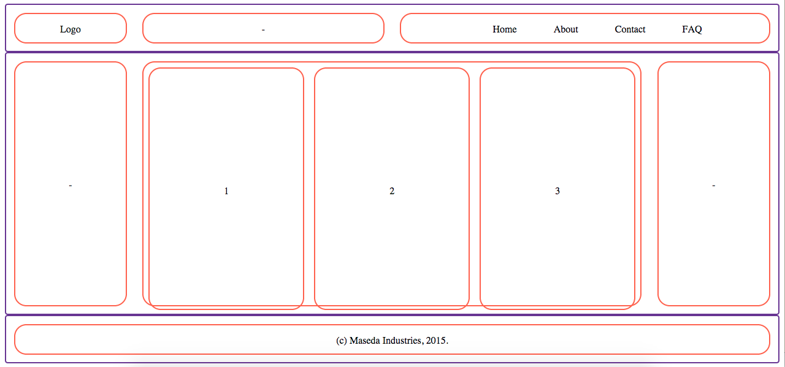

# CSS Grids

## Learning Objectives
* Explain the benefits of using CSS grids in web design.
* Identify the basic components of a grid.
* Review float, clearfix and other CSS properties.
* Build a grid from scratch.
* Use nested columns in a grid.
* Examine how grids are utilized in a front-end framework (e.g., Bootstrap).

## Opening Exercise

Whiteboard a wireframe for [TBD website].
* Focus on the site's overall structure and main components, not the specific content.
* Keep an eye for width, height, proportion, number of components.
* [Sample wireframe.](http://www.comentum.com/images/wireframes-sample/ecommerce/home.png)

## Why use a CSS grid?

### Structure
* Debugging CSS is a PAIN. It's easy to start throwing CSS selectors and properties at a problem, but once you get in too deep, it's hard to dig your way back out.
* Grids aren't a cure-all to CSS woes, but they give your site a form and structure to work from.

## Basic components of a grid

### Rows
* The highest-level component of a grid.
* Comprised of columns.
* [Show where rows are on an example website]

### Columns
* Contain and separate site content.
* [Show where columns are on an example website].


## Let's build a grid

You don't need a fancy-schmancy front-end framework to reap the benefits of a CSS grid. Let's start building one from scratch.

### Create HTML document

In your in-class folder, create a blank HTML file called `index.html`
* In the `<head>`, let's link to a stylesheet called `style.css`.
* And don't forget to create that stylesheet: `$ touch style.css`

```html
<!DOCTYPE html>
<html lang="en">
<head>
  <meta charset="UTF-8">
  <title>Document</title>
  <link rel=stylesheet href="style.css" type="text/css">
</head>
<body>
</body>
</html>
```

### Define Column and Row Selectors

Let's start by creating `.column` and `.row` class selectors.
* These will contain properties that all rows and columns, regardless of size, will possess.

```css
.row, .column {

}

.row {
  /* Let's add a border so we can see our rows better */
  border: 2px solid rebeccapurple;
}

.column {
  /* Let's add another border so we can see our columns better */
  border: 2px solid tomato;
}
```

Before we start defining widths and giving our grid system some versatility, we need to take care of a few things...

### Box-Sizing

**Q:** By default, what is `width` defined as?
* width = content

We want to be able to explicitly define our column widths so that they also include `border` and `padding`.
* `width` = `content` + `padding` + `border`
* This way, we know exactly how wide our columns will be.
* We can do this by changing the `box-sizing` property of our `.row` and `.column` selectors.

```css
/* styles.css */

.row, .column {
  /* By default, box-sizing is set to content-box */
  box-sixing: border-box;
}
```

### Clearfix

Our grid relies on being able to float columns. These columns will most likely contain content of various sizes.
* We need to make sure each piece of content is constrained to its respective row and column containers
* This is where the clearfix technique comes in. Fortunately, it's easy to implement (as long as you don't care about how your site looks in Internet Explorer).

```css
.row {
  overflow: auto;
}
```

Easy, right? But like I said, if we want to help out our IE friends, implementing clearfix requires a few more steps.

```css
/* The below code is in place of the previous clearfix example */

.row:before, .row:after {
  content: "";
  display: table;
}

.row:after {
  clear: both;
}
```

### Define Column Behavior

So our rows are actually good to go!
* They're just horizontal containers.
* Thanks to clearfix we don't need to worry about content overflow.
* Our columns will handle page width. Let's work on that now...

```css
.column {
  float: left;
  position: relative;
}
```

**YOU DO:** Let's give our rows and columns a spin.
* Take a minute or two to create some rows and columns in `index.html` using the class selectors we just made.
* What functionality do we currently have? What do we need to add?

```html
<body>
  <div class="row">
    <div class="column">Something</div>
    <div class="column">Something</div>
    <div class="column">Something</div>
  </div>
  <div class="row">
    <div class="column">Something</div>
    <div class="column">Something</div>
    <div class="column">Something</div>
  </div>
</body>
```

Right now, we can...
* **Separate content into rows and columns.**
  * What does it look like when we turn `float` off?
  * How about `overflow`?

We need to...
* **Set column widths.** We don't necessarily want our column widths to be defined by their content.
* **Define total width.** In any scenario, we want our total grid width to cover the entire page.
* **Give everything some space.** Our grid will look better if we give our rows and columns some breathing room.

### Create Columns with Specific Widths

**REF:** Show either example website or student whiteboard response from earlier example.

So we want to define our column widths not by the width of their content but how much of the page we want them to take up.
* Ex. a sidebar nav that takes up 1/6 of total page width.

Most grids have a column size of 12.
* That means the total column width for each row should equal 12.
* We're going to create a class selector for each column size.
  * `.column-1`: occupies 1/12 of total page width
  * `.column-3`: occupies a quarter (3/12) of total page width
  * `.column-12`: occupies entire (12/12) page width

**Q:** How are we going to define the widths for each of these classes?
* What unit should we use?
* How are we going to calculate these values?

```css
/* style.css */

/*
  How do we get these percentages?
  percentage = (n / 12) * 100
*/

.column-1 { width: 8.333%; }
.column-2 { width: 16.66%; }
.column-3 { width: 25%; }
.column-4 { width: 33.33%; }
.column-5 { width: 41.66%; }
.column-6 { width: 50%; }
.column-7 { width: 58.33%; }
.column-8 { width: 66.66%; }
.column-9 { width: 75%; }
.column-10 { width: 83.33%; }
.column-11 { width: 91.66%; }
.column-12 { width: 100%; }
```

You don't have to use the same class selector syntax as the above example.
* You can and should customize your grid to fit your own needs.
* Ex. `.col-2-3` = a column that takes up 2/3 width of its parent container

Let's apply these selectors to `index.html` in a way that resembles an actual website.
* Note the addition of the `.header` `.middle` and `.footer` class selectors to our rows.
* We'll also add some actual content to our columns.

```html
<!-- index.html -->

<body>
  <div class="row header">
    <div class="column column-2">Logo</div>
    <div class="column column-4">-</div>
    <div class="column column-6">
      <ul>
        <li>Home</li>
        <li>About</li>
        <li>Contact</li>
        <li>FAQ</li>
      </ul>
    </div>
  </div>
  <div class="row middle">
    <div class="column column-2">-</div>
    <div class="column column-8">So much content.</div>
    <div class="column column-2">-</div>
  </div>
  <div class="row footer">
    <div class="column column-12">(c) Maseda Industries, 2015.</div>
  </div>
</body>
```

Let's also add some styling that will help us visualize this better.
* Note we gave our `.header` `.middle` and `.footer` selectors some explicit heights.

```css
/* style.css */

.column {
  float: left;
  position: relative;
  border: 2px solid Tomato;
  border-radius: 20px;
  text-align: center;
}

/* Let's give the sections of our site some width/height */
.header > .column,
.footer > .column {
  height: 50px;
  line-height: 50px;
}

.middle > .column {
  height: 400px;
  line-height: 400px;
}

/* Let's tweak our faux nav menu so it doesn't look as terrible */
.header ul {
  margin: auto;
}

.header li {
  display: inline-block;
  list-style-type: none;
}
```

Let's take another look at our `index.html` in the browser.
* You can see our website has some form now.
* Our sections could use some space though...

### Gutters

**Q:** How should we go about putting space between the sections of our site?
* What CSS properties do we have at our disposal?

Let's give each of our columns a little bit of margin. That should put just enough space between them.

```css

.column {
  /* We don't want to add too much space, so 1% should be enough */
  margin: 1%;

  float: left;
  position: relative;
  border: 2px solid Tomato;
  border-radius: 20px;
  text-align: center;
}

```

Let's see what our webpage looks like now...


Ahh, what happened?
* Our width calculations are messed up since we added a 1% margin to each column.
* **Q:** How do we go about fixing this?
* Let's adjust our widths...

```css
/* Since we added 1% margin to each column, we need to adjust our widths by -2% (1% on the left, 1% on the right). */

.column-1 { width: 6.333%; }  /* = 8.333% - 2% */
.column-2 { width: 14.66%; }
.column-3 { width: 23%; }
.column-4 { width: 31.33%; }
.column-5 { width: 39.66%; }
.column-6 { width: 48%; }
.column-7 { width: 56.33%; }
.column-8 { width: 64.66%; }
.column-9 { width: 73%; }
.column-10 { width: 81.33%; }
.column-11 { width: 89.66%; }
.column-12 { width: 98%; }
```

Did that work?


Nice! Why did we have to do this? Didn't we set our `box-sizing` to `border-box` earlier in the class?
* Yes, but that does include `margin`. Our CSS would have automatically adjustd for any changes to `border` or `padding`.

#### Nested Columns

We can "incept" our grid and plant columns within columns.
* For example, say we want the middle column in the center of our site to be divided into three content sections.
* We can treat that middle column as being 12 columns wide and create the following `<div>` tags in our HTML...

```html
<!-- index.html -->

<div class="row middle">
    <div class="column column-2">-</div>

    <!-- Here is that middle column. -->
    <div class="column column-8">
        <!-- We can divide it into thirds the same way we would any row. -->
        <div class="column column-4">1/3</div>
        <div class="column column-4">2/3</div>
        <div class="column column-4">3/3</div>
    </div>

    <div class="column column-2">-</div>
  </div>
```

And while we're at it, let's change the border color of our nested columns so we can see them better.

```css
.column > .column {
  border: 2px solid springgreen;
}
```

Let's see how that changed our page...



**Be Warned:** Making columns (and rows) work might require a fair amount of tweaking depending on how your grid and gutters are set up.

## Exercise: Match That Grid (20min)

Use what we have learned in class to recreate the grid structure for [this website]().
* Clear out the HTML in the `<body>` of `index.html` and build it from scratch using the CSS selectors we created.
* Don't worry about content. Just outline the main portions of the site.
* **NOTE:** I would suggest removing the gutters / margin from the CSS and resetting your widths to their original values.

### Bonus
* Add gutters / margin wherever necessary.
* Replace the column class selector syntax (e.g., `.column-6`) with your own!
* Implement nested columns and/or rows.
* Add some content to your columns. Keep it simple - we don't expect you to recreate the site.

## Front-End Frameworks

**Q:** What is a CSS front-end framework?
* Like a library, in that it gives us a toolkit that we can use to streamline the front-end development process.
* But it's a framework, so that means we need to follow a certain structure and name things a certain way.
  * If you use Bootstrap but don't follow their protocol, Bootstrap styling won't work.

There are tons of front-end frameworks out there -- like Bootstrap, Foundation, Material Design -- that incorporate grid systems.
* They're not necessarily better. In fact, if you're only looking to implement a grid system and not any additional styling, you might be better off building a grid from scratch.
* Nevertheless, you will encounter these frameworks in the wild so let's get some experience with them.

## Bootstrap

[Bootstrap's got grids](http://getbootstrap.com/css/#grid).


Bootstrap uses a similar class selector syntax for columns as what we used in our from-scratch example.
* `col-md-6`
* Begins with `col-` and ends with `-6`, the width of that column.
* **Note:** You no longer need to use a `.column` class.
* Bootstrap also helps out with responsive design and allows us to set multiple column widths depending on the user's device.
  * In this example, `md` stands for "medium" and covers most laptops and desktops.
  * Don't worry about the other sizes for now. You'll learn about Responsive Web Design later this week.

### Exercise: Implement Bootstrap (20min)

Let's implement the grid you created in the last exercise using Bootstrap.
  1. Link the Bootstrap stylesheet to your `index.html` file [using a CDN](http://getbootstrap.com/getting-started/).
  2. Implement the same grid from the last exercise using Bootstrap row and column class selectors.
  3. If you finish early, feel free to experiment with responsive column widths and/or add some additional styling to your page.

## Additional Reading

* [Learn Layout: Clearfix](http://learnlayout.com/clearfix.html)
* [Bootstrap CSS Documentation](http://getbootstrap.com/css/)
