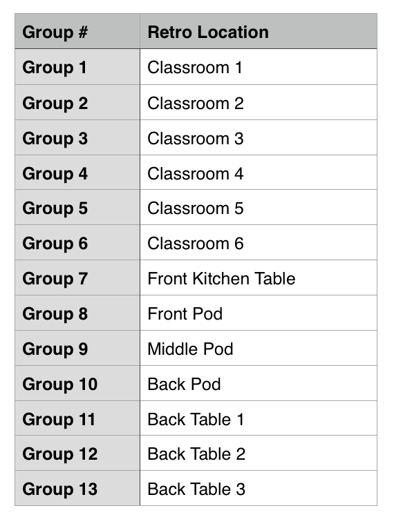

# WDI / UXDI Retro

## 1:30 - 3:15: Presentations

[Instructions here!](https://docs.google.com/document/d/1_rab9iyZA45RLauff5Zug4w3y-I9J0ijIH20pu0fbQM/pub)

## 3:15 - 3:30: Break

## 3:30 - 4:00: Retro

Students retro with their project teams.

### Locations

### Forms
[Use this form as a team](https://docs.google.com/forms/d/14nC6Ck_cz_DWhWtBBH6wiw7uQamhXs7ANsUFw2OfeJk/viewform)

[Feedback Form - Fill out individually afterwards (optional) ](https://docs.google.com/forms/d/1lTD6clql8Y3zAhGxn-KeaaEIXTwYNDSrUB_qRcgUrv8/viewform)

## 4:00 - 4:15: Break

## 4:15 - 4:45: Instructor Panel (Classroom 2)

What questions have you wanted to ask your instructors, but haven't had a chance to ask? Ask us anything!

## 4:45 - 5:00: Break

## 5:00 - 5:20: Guided Activity

Meet in Classroom 2
