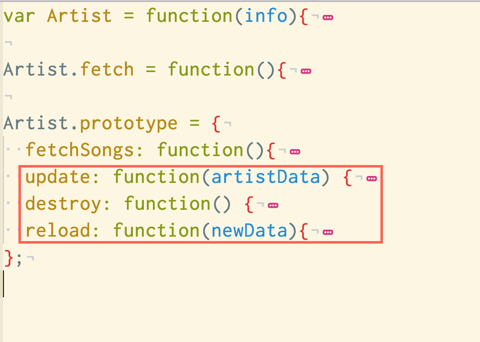
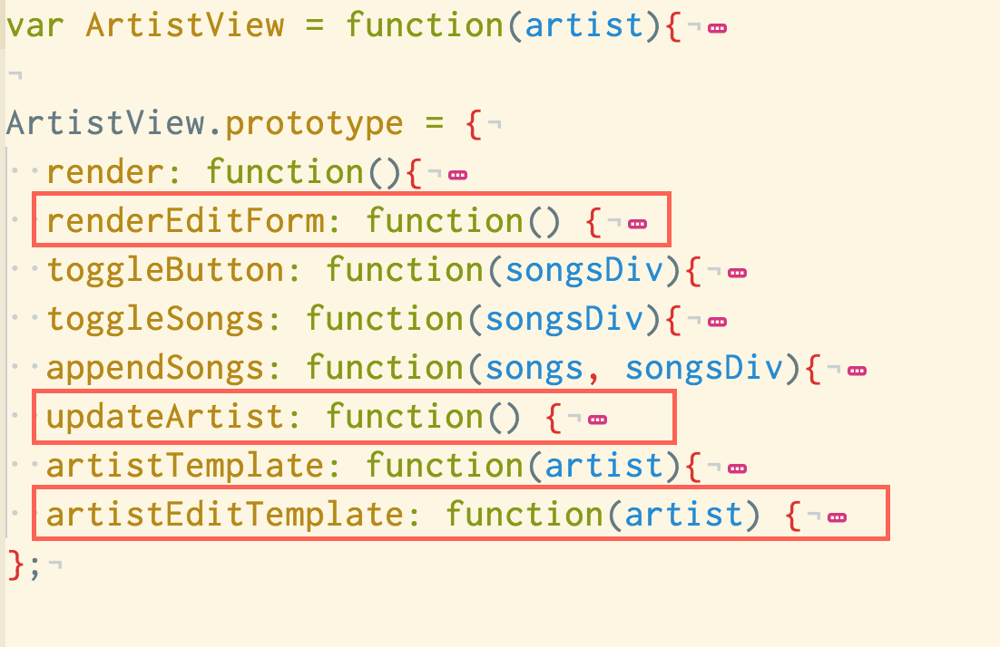

# OOJS on the Front End - Part Deux: Create, Update, Destroy

## Learning Objectives

- Use OOJS to structure front end code
- Build model objects that create, update, destroy data on the server
- Build view objects that render forms and interact with model objects
- Describe the role of model objects on the Front-end
- Describe the role of view objects on the Front-end


## Framing

Our goal for today is to complete our app so that we have basic CRUD
functionality for artists. This means we'll be able to Create, Edit/Update,
and Destroy artists. Additions to songs functionality will be a bonus.

Overall, our app has a couple of parts that work together to create that lovely
Single Page App Experience (SPA® Experience) ;)

### The Database

Postgres stores our data in a structured manner, so that we can find/update/destroy
quickly.

### The Backend

The backend exposes our app's data and functionality to the web (via HTTP). The
backend has a few parts:

* `app.js` - Loads express and other libraries, as well as the other parts of our app
  * `models` (Sequelize) -  these serve as the interface to the database, so our express app
    can easily interact with our data
  * `controllers` - define what routes our app responds to, and how to respond...
    this is usually by either finding data and returning it as JSON, or accepting
    JSON data to edit/update our DB
  * `views` - define how our app sends back HTML (when needed). In our case, our
    app only really sends back the `layout.hbs`, which is used to send the initial
    page to the user. This page provides the skeleton of our SPA, and also tells
    the user's browser to load the appropriate front-end JS.
  * `public` - where our front-end JS lives. This is in public so it can be sent
    to the user's browser.

### The Front-End

Our front-end code runs in the browser, and interfaces with the backend (over
HTTP) to request or update data, and then render the appropriate HTML.

It's worth noting that today, our front end code is served by the backend, but
really, it could live as a totally separate web app, or even native mobile /
desktop app! (That's the beauty of having an API, it can be used by any app).

* `script.js` - this is the main file that waits for the page to finish loading,
  and then starts up our app. In this case, it fetches all artists, and then
  displays them.
  * `models` - these classes are responsible for representing our data in a
  structured way, and for providing an interface to sync that data with the
  server. This keeps the rest of our code (i.e. views) clean of ajax requests.
  * `views` - these classes are responsible for:
    * rendering models into HTML
    * responding to events (clicking on buttons, etc) appropriately

## Overview of Today's Front-end

### Turn & Talk (10 minutes)

Look at the following two pictures... they show a summary of the methods we're
going to have at the end of today in our views. The highlighted ones are the
ones we'll be working on in this lesson.

Take 5 minutes to talk with your partner about what you think each method is
supposed to do and how it might work.

#### Artist Model Methods


#### Artist View Methods


## Editing Artists

For starter code, see the [oojs_part2_starter branch](https://github.com/ga-dc/tunr_node_oojs/tree/oojs_part2_starter)
For reference solution to just artists, see the [oojs_part2_edit branch](https://github.com/ga-dc/tunr_node_oojs/tree/oojs_part2_edit)

Before we begin, make sure your repo is set up:

1. If you simply cloned the repo (didn't fork it), skip to step 3.
2. If you forked and cloned, you won't have the most recent branches, so
   re-clone the repo from [GA-DC](https://github.com/ga-dc/tunr_node_oojs)
3. `cd` into your most recent clone
4. `git fetch`
5. `git checkout oojs_part2_starter`


Our first feature, editing, will be the most intense, so don't worry, it gets
better after this!

Overall, we want our feature to work like this:

1. Click the edit button
2. The view changes such that the various bits of text become editable fields
3. We edit the text in the fields and click submit.
4. The app updates the database
5. The app re-renders the artist to look like before, but with updated
   information

Let's take it step by step!

### Adding the Edit Button

The edit button needs to be in our existing `artistTemplate`, since it
needs to be visible on each artist's "show" view.

Let's add the button to the template:

```js
// html.append("<button class='showSongs'>Show Songs</button>");
html.append("<button class='editArtist'>Edit Artist</button>");
// html.append("<div class='songs'></div>");
```

Now we need to update our `render` method to add the appropriate event listener
on the button:

```js
var editButton = self.$el.find(".editArtist");

editButton.on("click", function() {
  self.renderEditForm();
});
```

Note that we're saying "when I click on the edit button", call the
`renderEditForm` method, so we should probably write that next!

### Rendering the Edit Form

Just like our rendering for the "show view", we'll need a method that:

1. Uses a template to build the HTML
2. Updates the `$el` to contain the new HTML
3. Adds any event listeners as needed

#### Making the Edit Form Template

Our template for the edit form is pretty similar to the one we wrote for "show".
The main difference is that here we're using `<input>` tags for `name` and
`photoUrl`, that are pre-populated with the artist's current values.

```js
artistEditTemplate: function(artist) {
  var html = $("<div>");
  html.append("<input name='name' value='" + artist.name + "'>");
  html.append("");
  html.append("<input name='photoUrl' value='" + artist.photoUrl + "'>");
  html.append("<button class='updateArtist'>Update Artist</button>");
  html.append("<button class='deleteArtist'>Delete Artist</button>");
  return(html);
}
```

#### Updating The El

Now that we have the template, let's write our `renderEditForm` method:

Right now, we've tackled using the template to generate HTML, and using that
HTML to update our view's `$el`.

```js
renderEditForm: function() {
  var self = this;
  self.$el.html(this.artistEditTemplate(this.artist));
},
```

But notice our submit button doesn't do anything!

#### Adding the Button Event Listener

Let's add an event listener. When the user clicks the **Update Artist** button,
we want to run a function that updates the artist:

```js
renderEditForm: function() {
  var self = this;
  self.$el.html(this.artistEditTemplate(this.artist));

  self.$el.find(".updateArtist").on("click", function() {
    self.updateArtist();
  });
},
```

Note the use of `$el.find(some_selector)` to ensure we only add an event
listener the the button that this view is responsible for (and not any other
views, like for a different artist).

At this point, we've added the funtionality to show the edit form... next we
need to actually take the data from the form and update the artist accordingly.

## Updating Artist on Submission

Once the user has submitted the form, we need to:

1. Gather the data from the form.
2. Ask the front-end `Artist` model to update using the gathered data
3. Have the `Artist` model make an AJAX `patch` (similar to a `put`) request to
   our back-end
4. Update the view to show the artist with the updated information.

### The `updateArtist` method

The `updateArtist` method in our view is what will orchestrate this
functionality.

### Gathering Data from the Form

First, we need to gather the data the user entered, then, we call the `update`
method on our artist, passing in the new data. (We'll make the `update` method)
next.

```js
updateArtist: function() {
  var self = this;
  var data = {  name:     $('input[name=name]').val(),
                photoUrl: $('input[name=photoUrl]').val() };
  self.artist.update(data);
},
```

### Adding `update` and `reload` methods to our Artist model

Since our view has asked the artist to update, we need to write that method!

This method takes the data passed in, and uses it to make an AJAX **patch**
request to our backend. The backend then responds with the updated artist info.

Note that we have to specify in our AJAX call that the method is patch. This
is the appropriate verb to specify that we may only update some attributes.

We also have to specify that we're sending JSON (the `contentType`), and we have
to pass in the data to use for the update as JSON. We do that using
`JSON.stringify()`. The data we're converting to JSON is the data that came from
the form:

```js
update: function(artistData) {
  var self = this;

  var url = "http://localhost:3000/artists/" + this.id;
  var request = $.ajax({
    url: url,
    method: "patch",
    data: JSON.stringify(artistData),
    contentType : 'application/json'
  }).then(
    function(updatedArtistInfo) {self.reload(updatedArtistInfo);}
  );
  return request;
},
```

Note that this method only updates the backend! We also need to `reload` our
copy of the artist that in our front-end app. To do that, we call the
`reload` method (which we're about to write) after the backend has updated the
artist successfully.

#### Reloading

To reload the artist, we take the updated artist data, and use it to update
each property on our artist model:

```js
reload: function(newData){
  for(var attrname in newData) {
    this[attrname] = newData[attrname];
  }
}
```

### Updating the `el` (show updated artist info)

Back in the view, we should update it so that **after** the update has been
made, and the artist has been reloaded, we re-render the 'show' view for the
artist (to get rid of the form, and display the updated data).

```js
updateArtist: function() {
    var self = this;
    var data = {  name:     $('input[name=name]').val(),
                  photoUrl: $('input[name=photoUrl]').val() };
    self.artist.update(data).then(function() { self.render(); });
  },
```

Why can we call `.then` on `artist.update()`? That's because in our update
method, we returned the jQuery promise object. In other words, updating an
artist is inherently asyn, it may take a while, so the method lets us ask "when
you're done updating, run this callback". In this case, the callback is to
render the show view.

## Deleting Artists (You Do in Groups of 2) (30 minutes)

For starter code, see the [oojs_part2_edit branch](https://github.com/ga-dc/tunr_node_oojs/tree/oojs_part2_edit)
For a solution, see the [oojs_part2_delete branch](https://github.com/ga-dc/tunr_node_oojs/tree/oojs_part2_delete)


Implement a feature so that the `edit` form has an additional button, which is
labeled 'Delete Artist'.

When the button is clicked, it should:

1. Call the `destroy` method on the Artist model. (you'll need to write that)
2. That method should make an AJAX delete request to delete the artist by ID.
3. Once the response has come back (and not before!) you should fade out the
   artist view's $el. (jQuery has a fadeOut method that makes this easy!)

## Bonus

Try to implement any of the following features:

### Creating New Artists

At the top of the page is a link or button for "Add Artist". When the button is
clicked, a form should appear (empty). Submitting the form should:

1. Create a new artist on the backend
2. Update the view to render the new artist

### Playing Songs

Add a button next to each song. When the button is clicked, it should:

1. Add an `audio` element tied to the song's `previewUrl`.
2. Stop / Remove any other auido players on the page.

### Update URLs (pushState)

Use `history.pushState` to update the url and reflect what you're editing. You
should be able to reload the page and go right back to the edit view

### CRUD songs

Add full CRUD functionality for songs. Either make a new main view like for
artists, or add edit / delete buttons next to each song, and a "new song" button
for each artist.

## Summary

That's it... we've written our first full(ish)-featured single page app. Time to
go relax at the SPA! ;)


