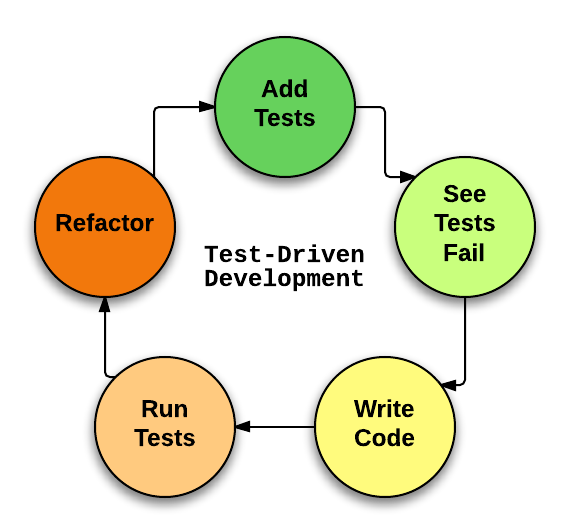
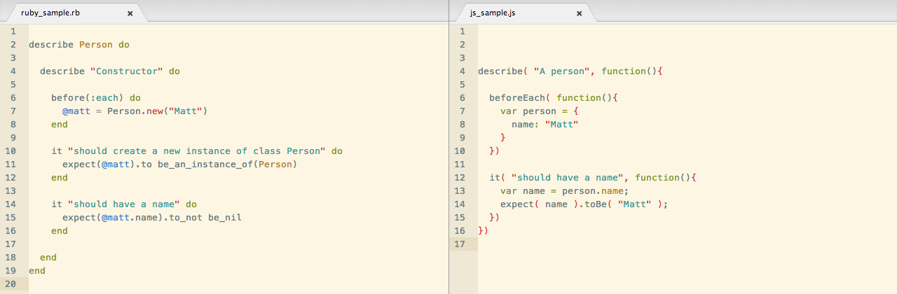
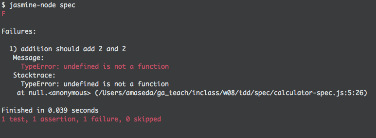
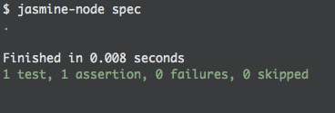

## Learning Objectives

* Explain the purpose of TDD/BDD.
* Review RSpec and test syntax.
* Describe Jasmine.
* Compare/Contrast Jasmine & RSpec.
* Setup Jasmine for a Node Project.

## Do You Test? (5 / 5)

**THINK-PAIR-SHARE**: We’ve already seen how to work with tests in ruby. To get us back in that mindset, spend the next few minutes to think-pair-share on:

* Why test?
* Why not test?
* What problem does testing solve?

For those of you who answered no, why not?
* **Time.** It's a waste of my time and effort to test.
* **It's too much.** I can test just fine using the console.
* **App complexity.** My app is too simple to require testing.

Why should we?
* **Bug detection.** Quickly identify unanticipated errors.
* **Code Quality.** Create standards for our code before writing it.
* **Time.** Shorten development time through bug detection.
* **Documentation.** Tests act as a documentation of sorts for how our code should work. Helpful to other developers and shareholders.
* **Jobs.** Testing is a job requirement across the board.

## Everybody Does It (5 / 10)

Testing is essential when working on large, complex projects.
* Take Ember.js for example. [If you look at the framework's repo](https://github.com/emberjs/ember.js#how-to-run-unit-tests), it comes packaged with a ton of tests.
* So many moving parts. And so many people contributing to them. Can you imagine how crazy this would get without testing?

## Test-Driven Development

### Remember RSpec?

We've already encountered TDD once with RSpec. What's RSpec?
* Ruby framework.
* Domain-specific language (DSL) for testing Ruby code.
* We didn't get around to it in class but it can integrate with Rails.

### The Process (5 / 15)

Testing gives us more control over our code.
* We anticipate our errors with tests.
* We can't move forward with faulty code because these tests must pass.



TDD step by step.
  1. **Think.** What do we want our code to do?
  2. **Write a test.** This test must fail. Why?
  3. **Run your test.** What do you see?
  4. **Write code.** How can we make this test pass?
  5. **Test passes.**
  6. **Refactor and Repeat.**

### Unit Testing (5 / 20)

A way to test the most basic component of a program. In our RSpec lesson, this was a class.

Here's a sample from Matt's lesson, in which we tested the functionality of a Person class.
* What's the purpose of this chunk of code?
* What does the syntax mean?
  * `describe`
  * `before`
  * `expect`
  * `.to`, `.to_not`

```ruby
# Let's test the Person class.
describe Person do

  # Specifically, let's test its constructor method.
  describe "Constructor" do

    # Before each test, let's create and store a Person instance in @matt.
    before(:each) do
      @matt = Person.new("Matt")
    end

    # Test 1: @matt should be an instance of Person.
    it "should create a new instance of class Person" do
      expect(@matt).to be_an_instance_of(Person)
    end

    # Test 2: @matt should have a name.
    it "should have a name" do
      expect(@matt.name).to_not be_nil
    end
  end
end
```

## Jasmine

Today we're diving into the world of Javascript testing.
* One (but not the only) JS testing framework is Jasmine.
* It bills itself as a "Behavior Driven Development" framework...

## Behavior-Driven Development (5 / 25)

What does "Behavior Driven Development" mean and how is it different from TDD?
* BDD integrates Agile development into TDD.
  * What is the purpose of the application? Who is invested in your application? What are your user stories?
  * Only create tests that contribute to that direction.
* We've actually already been implementing it.
  * Verbose test descriptions. Can be read in plain English.
  * BDD is less concerned with granularity of our tests and more with the final outcome.
* BDD is not defined by syntax. It's a process to simplify and refine the number of tests you are running.
* Make sure that the purpose of your application is reflected in your tests.

## Meet Jasmine (10 / 35)

Here's a sample Jasmine test from their [documentation](http://jasmine.github.io/2.1/introduction.html)...

```js
describe("A suite is just a function", function() {
  var a;

  it("and so is a spec", function() {
    a = true;

    expect(a).toBe(true);
  });
});
```

Does any of it look familiar?
* What similarities does it have with RSpec?
  * `describe`, `it`, `expect`
  * Fortunately, we get to work with the same testing syntax as we do in Ruby.
* Look at them side-by-side...



Ruby aside, does this Jasmine test remind you of anything from WDI weeks 1-2?
* Getting some strong callback vibes from this...
* That's because `describe`, `beforeEach` and `it` are just functions!

Let's break down the format of a test.
* No need to code along here. We'll make our own tests later in this class.

**1. Suite**

```js
describe( "A person", function(){
  // Specs go here.
});
```

A "suite" is the highest-level container in our test file.
* A suite defines what we are testing. Oftentimes, this is an object.
* Indicated using the `describe` function.
* Takes two arguments: (1) a string, (2) a function
  * (1) The string is the name of what we are testing
  * (2) The function contains the actual tests

```js
describe( "A person", function(){
  // Specs go here.
});
```

**2. Spec**

```js
describe( "A person", function(){

  it( "should be named Adrian", function(){
    // Expectations go here.
  });

  it( "should be 28 years old", function(){
    // Expectations go here.
  });
});
```

In the "spec," we target a specific part of the suite.
* In the above example, we test to see if this person is named Adrian and is 28 years old.

**3. Expectations**

```js
describe( "A person", function(){

  it( "is named Adrian", function(){
    var person = { name: "Adrian", age: 28 };
    var name = person.name;
    expect( name ).toBe( "Adrian" );
  });

  it( "should be 28 years old", function(){
    var person = { name: "Adrian", age: 28 };
    var age = person.age;
    expect( age ).toBe( 28 );
  });
});
```

Expectations are the meat-and-potatoes of our tests.
* Begins with code content. In this case, saves the name of the person in question to a variable.
* Last line is the actual expectation.
  * Begins with `expect`. Takes one argument, the variable whose value we are testing.
  * Followed by a **matcher** (e.g., `toBe`), which tests the expectation in a particular way.
    * A full list of Jasmine's native matchers can be found [here](http://jasmine.github.io/edge/introduction.html#section-Expectations).

**4. Refactor**

Could we make our tests here DRYer?
* We instantiate the `person` variable twice. Is there a function available that will let us do this once?

```js
describe( "A person", function(){

  beforeEach( function(){
    var person = {
      name: "Adrian",
      age: 28
    };
  });

  it( "is named Adrian", function(){
    var name = person.name;
    expect( name ).toBe( "Adrian" );
  });

  it( "should be 28 years old", function(){
    var age = person.age;
    expect( age ).toBe( 28 );
  });
});
```

## Getting Started

First, we're going to install jasmine-node globally.
* `$ npm install jasmine-node -g`
* Now we can use Jasmine across projects.

## What are we going to test?

During this lesson we are going to write tests for and create a calculator application.
* We're going to stick with Javascript here. No HTML/CSS at the moment.
* We're going to write this using Node, so you're going to see some unfamiliar syntax.
* I'll try to explain as we go along, but don't worry understanding it 100% now. You'll learn more about Node as the week goes on.

## Let's get to work (20 / 55)

### Create your JS files.

Switch into your in-class folder and create the following.
* Our calculator: `$ touch calculator.js`
* Our test folder: `$ mkdir spec`
* Our test file: `$ touch spec/calculator-spec.js`

### Create our first test.

Before we write any of our calculator code, we're going to create a test.
* Let's start simple and create a test for our calculator's add functionality.
* But first, let's prepare our spec file so that it can actually test our calculator.

```js
// spec/calculator-spec.js

// Not unlike Ruby, `require` lets us reference `calculator.js` in our spec file.
// Now, any functions defined in calculator.js can be referenced using the format `calculator.functionName`.

var calculator = require( "../calculator" )
```

Let's break this test down according to its parts. First, **the suite**.
* What should our suite look like?

```js
var calculator = require( "../calculator" )

describe( "addition", function(){
  // Tests for our addition function will go in here.
});
```

Next up, let's make **a spec**.
* Let's test if our addition function can add 2 and 2 together.
* What should our spec look like?

```js
var calculator = require( "../calculator" )

describe( "addition", function(){
  it( "should add 2 and 2", function(){
    // Expectations go in here.
  })
});
```

And finally, let's create **the expectations** for our test.
* What should our add function look like?

```js
var calculator = require( "../calculator" )

describe( "addition", function(){
  it( "should add 2 and 2", function(){
    // Let's store the sum of our addition function.
    // Because our add function will be stored in calculator.js, we can reference it as such...
    var sum = calculator.add( 2, 2 );

    // Now what do we expect that sum to be?
    expect( sum ).toBe( 4 );
  })
});
```

That looks like a good test to me. Let's run it!
* From your in-class folder, run: `$ jasmine-node spec`
* What error do we get?



Of course, it failed. Let's create that addition function.

```js
// calculator.js

exports.add = function(){

}
```

Wait, what in the world is `exports`?!
* Our first dose of Node syntax. Don't worry, though, it's pretty straightforward.
* With `exports` we can, well, "export" `add` or any other function in `calculator.js` to another javascript file.
  * Say we had an `accounting.js` file. We could give it full calculator functionality by `require`ing `calculator.js`.

Moving on. Let's fill out our `add` function.

```js
exports.add = function( addend1, addend2 ){
  return ( addend1 + addend2 );
};
```

Let's run our test again.



### We Do: Let's do the same for subtract. (5 / 60)
* Create the test - run your test - create the function - run your test.

## Break (10 / 70)

## Exercise: Build Out Our Calculator (15 / 85)

Follow the same process and add some functionality to our calculator.
  1. Multiplication
    * Include a spec for multiplying by 0.
  2. Division
    * Include a spec for dividing by 0.
  3. Square
  4. Exponential

### Bonus
Test for error messages when your calculator makes an invalid operation.
* For example, test to make sure that your calculator returns a helpful error message when it tries to divide by 0.

Test and add some advanced functionality.
* Average
* Factorial
* Logarithmic

## Exercise (Cont.): Add Some Matchers (10 / 95)

We've already played around with one matcher in our test expectations: `.toBe( )`
* Jasmine comes with a number of native matchers
* Incorporate the following matchers into your calculator.
  * `.toBeGreaterThan()` and `.toBeLessThan()`
  * `.toBeNull()`
  * `.toContain()`
  * `.not.` (matcher prefix)
* Need help? Look at the [Jasmine Documentation](http://jasmine.github.io/2.0/introduction.html#section-Matchers).

### Bonus

* Incorporate the `.toMatch()` matcher into your calculator.
  * **Hint:** requires Regex
* [Create your own custom matcher](http://jasmine.github.io/2.0/custom_matcher.html).

## Object-Oriented Javascript (10 / 105)

You'll be spending a good portion of this week stepping up your OOJS game.
* Let's reformat our calculator to reflect a Javascript object.
* Won't require any changes to our tests. Just `calculator.js`.

```js
// calculator.js

// Think of `module.exports` as a collection of `exports.functionName`'s.
// Here it's set to an object that contains all of our calculator functionality.
// Imagine that `module.exports` was replaced with `var calculator`.

module.exports = {
  add: function( addend1, addend2 ){
    return ( addend1 + addend2 );
  },

  subtract: function( minuend, subtrahend ){
    return ( minuend - subtrahend );
  },

  // The rest of your calculator functions go here.
}
```

## Exercise (Cont.): Refactor Calculator as Object (5 / 110)

Refactor your calculator.js file so that instead of writing out a bunch of `functionName.exports`, all of your functions are condensed into one Javascript object.
* Set `module.exports` equal to that object.

[Here's the calculator solution](https://github.com/ga-dc/jasmine-calculator) in case you need some guidance.

## Render Test Results in the Browser (10 / 120)

A cool Jasmine feature is that you can create a `SpecRunner.html` file to render test results in the browser.
* Here's a [SpecRunner template](https://github.com/jasmine/jasmine/blob/master/grunt/templates/SpecRunner.html.jst). All you need to do is reference your own JS and spec files.
* Ours will look like this...

```html
<!DOCTYPE html>
<html>
<head>
  <meta charset="utf-8">
  <title>Jasmine Spec Runner v<%= jasmineVersion %></title>

  <link rel="shortcut icon" type="image/png" href="lib/jasmine-<%= jasmineVersion %>/jasmine_favicon.png">
  <link rel="stylesheet" href="lib/jasmine-<%= jasmineVersion %>/jasmine.css">

  <script src="lib/jasmine-<%= jasmineVersion %>/jasmine.js"></script>
  <script src="lib/jasmine-<%= jasmineVersion %>/jasmine-html.js"></script>
  <script src="lib/jasmine-<%= jasmineVersion %>/boot.js"></script>

  <!-- include source files here... -->
  <script src="calculator.js"></script>

  <!-- include spec files here... -->
  <!-- <script src="spec/SpecHelper.js"></script> -->
  <script src="spec/calculator-spec.js"></script>

</head>

<body>
</body>
</html>
```

[INSERT SCREENSHOT OF FUNCTIONING SPECRUNNER.HTML]

## Break (10 / 130)

## Exercise + Homework: Clock Hands (20 / 150)

With the remaining time in class I'd like you to create this [Clock Hands angle calculator](https://github.com/ga-dc/sundial) using a TDD approach.
* There is no single way to do this, so feel free to create whatever tests you would like.
* While you're together, I encourage you to tackle this exercise pair-programming style. Have one person write the test and the other write the code to make it pass. Switch with each test.

## Additional Reading

* [Difference Between TDD and BDD](https://joshldavis.com/2013/05/27/difference-between-tdd-and-bdd/)
* [Jasmine Documentation](http://jasmine.github.io/2.1/introduction.html)
* [Creating Custom Matchers in Jasmine](http://jasmine.github.io/2.0/custom_matcher.html)
* [Testing AJAX Calls with Jasmine](http://jasmine.github.io/2.1/ajax.html)
