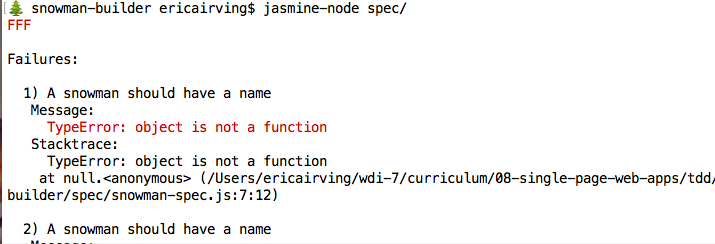
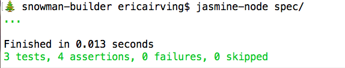

## Learning Objectives

* List benefits of unit testing in collaborative development process.
* Explain the role of testing in Behavior Driven Development (BDD).
* Identify language-agnostic patterns in testing syntax and methodology.
* Differentiate the roles of and relationships between `suite`, `spec`, and `expectation` in the context of Jasmine testing.
* Implement `beforeEach()` and `afterEach()` to DRY up test code.
* Use the `jasmine-node` CLI to run Jasmine tests.
* Plan a project by creating a series of unit tests that define its parameters.

## Do You Even Test, Bro? (10/10)

We first encountered Test Driven Development during Unit 2, when we wrote unit tests in Ruby using RSpec.

**LIVE SURVEY**:
Sort yourself into one of the following categories:
1. I have used TDD, and I loved it.
2. I have used TDD, and I hated it.
3. I have not used TDD, but I want to.
4. I have not used TDD, and I do not want to.

Take a few minutes to jot down your answers to the following in the appropriate section of this [GoogleDoc](https://docs.google.com/a/generalassemb.ly/spreadsheets/d/1uzXmU1219p72E5_z-hvOJHYzqa6vD9qt4rBK7gqblmc/edit?usp=sharing):
* For those of you who answered "no" to either part, why not? What did you or would you do instead?
* For those you answered "yes" to either part, why do you find testing valuable? What problem(s) does testing solve?

**ST-WG**: What patterns/themes/words/ideas do we see recurring in these answers?

> Some possible responses...
* Cons
 * **Time.** It's a waste of my time and effort to test.
 * **It's too much.** I can test just fine using the console.
 * **App complexity.** My app is too simple to require testing.
* Pros
 * **Bug detection.** Quickly identify unanticipated errors.
 * **Code Quality.** Create standards for our code before writing it.
 * **Time.** Shorten development time through bug detection.
 * **Documentation.** Tests act as a documentation of sorts for how our code should work. Helpful to other developers and shareholders.
 * **Jobs.** Testing is a job requirement across the board.

## All Together Now (5 / 15)

When it comes to development in teams, both the benefits and the potential pitfalls of testing practices increase. Many feel that testing is essential when working on large, complex projects.

* Take Ember.js for example. [If you look at the framework's repo](https://github.com/emberjs/ember.js#how-to-run-unit-tests), it comes packaged with a ton of tests.
* So many moving parts. And so many people contributing to them. Can you imagine how crazy this would get without testing?

Two common pain points in the wild are creating test coverage for existing code bases and ensuring that test suites are adequately maintained as an application grows in complexity. BOTH of these can be avoided by using TDD/BDD as tools for ***planning***.  

## Review: Test-Driven Development Basics

### "The" Process, Reconsidered (5 / 20)


A planning-oriented approach TDD
- Phase One: Before You Code
  - **Think.**
    - What do we want this app/feature to do?
    - What are its components? (Think models!)
    - What properties should each of those components have? What should they be able to do?
    - What behaviors do you definitely want to avoid?
  - **Write _tests_ an outline of your app/feature using testing syntax.**
    - For today, we're going to break this down even further, first writing suites and specs, then going back and adding expectations.
> - Phase 2: While You Code
  - **Run your tests.** Seeing red.
  - **Write code.** How can we make this test pass?
  - **Test passes.** Green light.
  - **Refactor and Repeat.**

### Unit Testing (5 / 25)

We've already encountered TDD once with RSpec. Back then, we engaged in "Unit Testing."
* Addresses the **what** of testing, while TDD covers the **when** and **why**.
* Test the most basic component of an application. Not necessarily the smallest.
* In a Unit test we can test any facet of a person.
  * In can be a property (e.g., does this person have a name?)
  * It can be a method (e.g., can this person talk?)

We'll be doing this again when testing Javascript.

## Jasmine

Today we're diving into the world of Javascript testing.
* One JS testing framework is Jasmine.
  * Not the only one. There's [Mocha](https://mochajs.org/), [QUnit](https://qunitjs.com/) and more...

* **Getting Started**: First, we're going to install jasmine-node globally.
  * `$ npm install  -g jasmine-node`
  * Now we can use Jasmine across projects.

## Meet Jasmine (10 / 35)

Here's a sample from the RSpec lesson in Week 5...

```ruby
# Let's test the Person class.
describe Person do

  # Specifically, let's test its constructor method.
  describe "Constructor" do

    # Before each test, let's create and store a Person instance in @matt.
    before(:each) do
      @matt = Person.new("Matt")
    end

    # Test 1: @matt should be an instance of Person.
    it "should create a new instance of class Person" do
      expect(@matt).to be_an_instance_of(Person)
    end

    # Test 2: @matt should have a name.
    it "should have a name" do
      expect(@matt.name).to_not be_nil
    end
  end
end
```

...and here's a sample Jasmine test from their (excellent) [documentation](http://jasmine.github.io/2.1/introduction.html)...

```js
describe("A suite is just a function", function() {
  var a;

  it("and so is a spec", function() {
    a = true;

    expect(a).toBe(true);
  });
});
```

Does any of it look familiar? *Yes*
* What similarities does it have with RSpec?
  * `describe`, `it`, `expect`
  * Fortunately, we get to work with the same testing syntax as we do in Ruby.
* Look at them side-by-side...


## Let's get to work (20 / 55)

### Create your JS files.

Switch into your `sandbox` folder and ...
```bash
$ mkdir snowman-builder
$ cd snowman-builder
$ touch snowman.js
$ mkdir spec #our testing folder
$ touch spec/snowman-spec.js # our test file
```

### Think.

Before we write any of our snowman code, we're going to create a test. And before we create a test, we're going to think: What do I want my snowman builder to do? What should the snowmen it creates be like?

```js
//I want my snowman builder to create a snowman object
//My winter wonderland is a friendly place, so I want each snowman to have a name
//In order for it to really be a snowman, it needs to have a carrot nose.
//It also needs stick arms.
//If the snowman is named Olaf, he should like warm hugs.
```

### Outline.

```js
// spec/snowman-spec.js

// Not unlike Ruby, `require` lets us reference `snowman.js` in our spec file.

var snowman = require( "../snowman" );
```
Let's break this test down according to its parts.

1. **The Suite**.

```js
describe( "A snowman", function(){
  // Specs go here.
});
```

A "suite" is the highest-level container in our test file.
* A suite defines what we are testing. Oftentimes, this is an object.
* Indicated using the `describe` function.
* Takes two arguments: (1) a string, (2) a function
  * (1) The string is the name of what we are testing
  * (2) The function contains the actual tests

**2. The Specs**

```js
describe( "A snowman", function(){

  //My winter wonderland is a friendly place, so I want each snowman to have a name.
  it( "should have a name", function(){

  });

  //In order for it to really be a snowman, it needs to have a carrot nose.
  it("should have a carrot nose", function () {

  });

  //It also needs stick arms.
  it("should have stick arms", function () {

  });

  //If the snowman is named Olaf, he should like warm hugs.
  describe( "a snowman named Olaf", function(){
    it( "should like warm hugs", function(){

    });
  });

});
```

In the "spec," we target a specific part of the suite.
* In the above example, we test to see if this snowman is named Olaf, has carrot arms and a stick nose, and likes warm hugs.

## Your Turn!

With your Project 3 group members, start working through the think and outline steps for your project.

## Great Expectations!

Now that we have the pieces of our snowman builder described, we can start thinking about how we'll know that our snowmen are living up to our expectations.

```js
describe( "A snowman", function(){

  //My winter wonderland is a friendly place, so I want each snowman to have a name.
  it( "should have a name", function(){
    //If I create a new snowman and set its 'name' property to  "Olaf", returning that snowman's name should return "Olaf"
  });

  //In order for it to really be a snowman, it needs to have a carrot nose.
  it("should have a carrot nose", function () {
    //If I create a new snowman, I should immediately be able to return "carrot nose" as one of its features
  });

  //It also needs stick arms.
  it("should have stick arms", function () {
    //If I create a new snowman, I should immediately be able to return "stick arms" as one of its features
  });

  //If the snowman is named Olaf, he should like warm hugs.
  describe( "a snowman named Olaf", function(){
    it( "should like warm hugs", function(){
      //I will know that my Olaf likes warm hugs because when I call a function 'hug' on him, he will say, "I like warm hugs"
      //If I hug a snowman with a different name, he should say something else
    });
  });
});
```
## Your Turn!

## Setting Expectations

**Expectations** are the meat-and-potatoes of our tests.
* Begins with code content. In this case, saves the name of the person in question to a variable.
* Last line is the actual expectation.
  * Begins with `expect`. Takes one argument, the variable whose value we are testing.
  * Followed by a **matcher** (e.g., `toBe`), which tests the expectation in a particular way.
    * `toBe` isn't Jasmine's only matcher. Along with equality you can check for greater/less than, null and more.
    * A full list of Jasmine's native matchers can be found [here](http://jasmine.github.io/edge/introduction.html#section-Expectations).
    * If you're feeling adventurous, you can even [create your own custom matcher](http://jasmine.github.io/2.0/custom_matcher.html).

```js
describe( "A snowman", function(){

  //My winter wonderland is a friendly place, so I want each snowman to have a name.
  it( "should have a name", function(){
    //If I create a new snowman and set its 'name' property to  "Olaf", returning that snowman's name should return "Olaf"
    var olaf = new Snowman("Olaf");
    expect( olaf.name ).toBeDefined();
  });

  //In order for it to really be a snowman, it needs to have a carrot nose.
  it("should have a carrot nose", function () {
    //If I create a new snowman, I should immediately be able to return "carrot nose" as one of its features
    var olaf = new Snowman("Olaf");
    expect ( olaf.features ).toContain("carrot nose");
  });

  //It also needs stick arms.
  it("should have stick arms", function () {
    //If I create a new snowman, I should immediately be able to return "stick arms" as one of its features
    var olaf = new Snowman("Olaf");
    expect ( olaf.features ).toContain("stick arms");
  });

  //If the snowman is named Olaf, he should like warm hugs.
  describe("A snowman named Olaf", function(){
    it( "should like warm hugs", function(){
      var frosty = new Snowman("Frosty");
      var olaf = new Snowman("Olaf");
      //I will know that my Olaf likes warm hugs because when I call a function 'hug' on him, he will say, "I like warm hugs"
      expect( olaf.hug() ).toBe( "I like warm hugs!" );
      //If I hug a snowman with a different name, he should say something else
      expect( frosty.hug() ).not.toBe( "I like warm hugs!" );
    });
  });

});
```

**4. Refactor**
``` js
describe( "A snowman", function(){
  var olaf;

  beforeEach(function(){
    olaf = new Snowman("Olaf");
  });

  it( "should have a name", function(){
    expect( olaf.name ).toBeDefined();
  });

  it("should have a carrot nose and stick arms", function () {
    expect ( olaf.features ).toContain("carrot nose", "stick arms");
  });

  describe("A snowman named Olaf", function(){
    var frosty;
    it( "should like warm hugs", function(){
      frosty = new Snowman("Frosty");
      expect( olaf.hug() ).toBe( "I like warm hugs!" );
      expect( frosty.hug() ).not.toBe( "I like warm hugs!" );
    });
  });

});
```
### Let's Test It Out!
That looks like a good test to me. Let's run it!
* From your in-class folder, run: `$ jasmine-node spec`
* What error do we get?



Of course, it failed. There's nothing in snowman.js to test...

### Let's Build a Snowman!

```js

var Snowman = function(name) {
  name = this.name;
};

Snowman.prototype = {
  hug: function(){
    if (this.name == "Olaf") {
      return "I like warm hugs!";
    }
    else {
      return "Chill out, man!";
    }
  }
};
```
Let's run our test again: `$ jasmine-node spec`



## Quiz Questions

## Quick Reference

## Additional Reading

* [Difference Between TDD and BDD](https://joshldavis.com/2013/05/27/difference-between-tdd-and-bdd/)
* [Jasmine Documentation](http://jasmine.github.io/2.1/introduction.html)
* [Creating Custom Matchers in Jasmine](http://jasmine.github.io/2.0/custom_matcher.html)
* [Testing AJAX Calls with Jasmine](http://jasmine.github.io/2.1/ajax.html)
