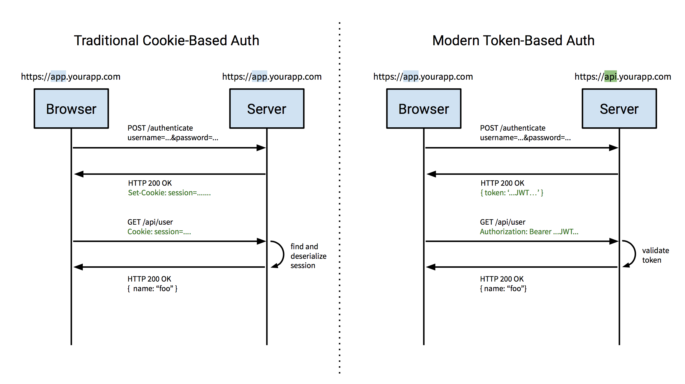

# Token-Based Authentication in Angular

## Learning Objectives

- Differentiate between token and cookie-based authentication
- Describe how token-based authentication is implemented, and when it's necessary
- List common security issues when implementing token-based authentication
- Use the devise_token_auth gem to implement token-based auth in a rails app.
- Use the ng-token-auth plugin to implement token-based auth in an angular application

## Methods of Authentication - Cookie vs Token

So far, we've seen authentication in rails apps using sessions and cookies.
Generally, the flow looked like this:

Assuming the user is registered:

1. When the user logs in, the system confirms their username and password match, and if so, starts a session which contains the user's id.
2. The user's browser is 'linked' to the session by storing a cookie, which includes a unique, long, hard-to-guess `session_id`.
3. On subsequent requests, the browser includes the cookie.
4. The server compares the `session_id` of the included cookie to it's own database of sessions, and loads the correct session for that request.
5. Our server-side app loads the user's info from the session as `currentUser`

Logging out simply destroys the session (or at least removes the user info from the session).

### Issues with Cookie-based Auth

It's possible to use cookie-based authentication in angular, but it turns out
that it's not the preferred way to implement authentication. There are a few
reasons for this:

Due to browser security restrictions regarding cookies and CORS, setting
cookies for AJAX requests requires additional configuration and complexity.

Without cookies, managing CSRF security can be a real issue. Tokens allow us to
safely disable CSRF protection for AJAX requests. The reason behind this has to
do with the fact that sites and 'trick' the browser to send cookies on forged
requests, but *can't* trick the browser into sending tokens.

Finally, cookies are only valid for *web apps*. If we wanted to build native
mobile or desktop (or even other server apps) that authenticate against our API,
we'll need to use another solution. Tokens based auth is by far the preferred
solution.

### How Token Based Auth Works

In general, token-based auth is very similar to cookie based auth. The main
difference is that the token (simialar to the session id) is NOT stored in a
cookie. Instead, it's stored in memory by a JS app (or in native apps, in memory).

1. When the user logs in, the system confirms their username and password match, and if so, it sends a response to the client app that includes a token (in the HTTP headers)
2. The client app 'remembers' the token in memory or in local storage.
3. On subsequent requests, the client app includes the token in the HTTP headers.
4. The server compares the token it's own database of users / tokens, and loads the correct user for that request.
5. The server-side app puts that user into a variable like `currentUser`



As we'll see, with the right gems / plugins, this process can be made as seamless
as traditional cookie-based auth.

### Token Security

There are some subtle security issues that need to be considered with with
token-based auth. Primarily there are two things:

* Timing based attacks
* Token rotation only usable once to prevent reply attacks

## Outline for Today

Our goal today is to update both the API and the Angular apps for Grumblr to
support token-based authentication, including signup, login, and logout.

First, we're going to implement token-based auth on the API (backend) using the
[devise_token_auth gem](https://github.com/lynndylanhurley/devise_token_auth).

Once we have that working, we're going to implement auth into our angular app
using a complementary plugin, [ng-token-auth](https://github.com/lynndylanhurley/ng-token-auth).

## Grumblr Api

https://github.com/ga-dc/grumblr_rails_api

Open it locally in your text editor. (You might already have it).

Make sure it's working by running `rails s` and open it up in your browser: http://localhost:3000/grumbles

### Add Devise

```rb
# Gemfile.rb

gem 'devise'
```

```
$ bundle install
$ rails g devise:install
```

Next, install the devise token auth gem:

```rb
# Gemfile.rb

gem 'devise_token_auth'
```

```
$ bundle install
$ rails g devise_token_auth:install User auth
```

The first part `User`, is the model. The second part `auth`, is the mount point.

```diff
# app/models/user.rb

- :confirmable, :omniauthable
```

Possible issues here:

- explicitly including `:confirmable`.
- if you put `devise_token_auth` first, it will still try to mount confirmable option.

In config/application.rb

```diff
- :methods => :any
+ :methods => :any,
+ :expose  => ['access-token', 'expiry', 'token-type', 'uid', 'client']
```

In config/initializers/devise.rb

```diff
- config.navigation_formats = ['*/*', :html]
+ config.navigation_formats = ['*/*', :html, :json]
```

We need this to enable logging in with JSON.

`rake routes` should show devise_token_auth routes.

In db/migrate/last_migration_file.rb, remove entire confirmable section. Under user info,
comment out everything but `t.string :email`

    $ rake db:migrate

 Update the seed script

```diff
# db/seeds.rb

+ User.destroy_all
+ User.create!(email:'barb@example.com', password:'pizzajammy')
+ User.create!(email:'bob@example.com', password:'pizzajammy')
```

    $ rake db:seed

Restart your server, and try logging in!

    $ curl -H 'Content-Type: application/json' \
	   -X POST http://localhost:3000/auth/sign_in \
	   -d '{"email": "bob@example.com", "password": "pizzajammy"}'

## References

* http://blog.ionic.io/angularjs-authentication/
* https://auth0.com/blog/2014/01/07/angularjs-authentication-with-cookies-vs-token/
* https://scotch.io/tutorials/the-ins-and-outs-of-token-based-authentication
* [JSON Web Tokens, another way to implement token based auth](https://jwt.io)
