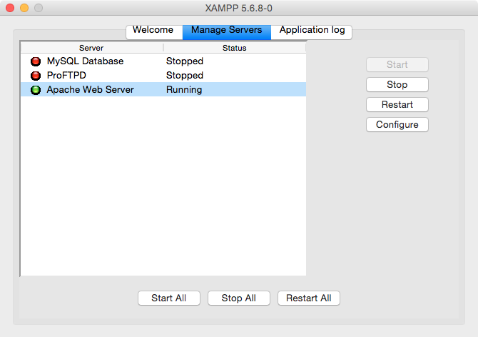

# Making a "Contact Me" form with PHP

[Screencast](http://youtu.be/O11hPhF5GAA)

## LOs

- Start Apache running locally on your computer.
- Write a PHP function that contains variables.
- Connect PHPMailer to your e-mail account.
- Send an e-mail via an HTML form using PHPMailer.

## What is PHP, and why does everyone hate it?

PHP originally stood for Personal Home Page... because it was created by some guy to use just on his personal home page. He had no intention of creating a programming language.

However, nothing like it really existed, so other people caught wind of what he was using and started adding their own functionalities to it.

Thus, PHP evolved organically. And as a result, it's kind of a mess.

PHP is very procedural. It doesn't really have objects. Instead of giving you an Array object that has methods attached to it, it just gives you 53 functions with "array" in the name -- 9500 built-in functions, all in the global namespace.

### At the same time...

There are several reasons to like PHP:

1. It's super-easy to pick up. It looks a lot like Javascript, and because you're dealing with functions instead of objects, it's easier to read.

2. It's *everywhere*. It had a massive head start.

3. It's easy to embed in HTML. PHP works just like `.html.erb` or `.hbs` files, and you don't need to do anything fancy for that to work. For example:

```HTML
<!DOCTYPE html>
<html>
  <head>
    <title>Hello</title>
  </head>
  <body>

  <?php
    $adjectives = array("attractive", "terrible", "sad", "lugubrious");
    $adjective = $adjectives[array_rand($adjectives, 1)];
  ?>
    <h1><?php echo("My, you're looking $adjective today!"); ?></h1>

  </body>
</html>
```

4. It makes a lot of back-end concepts easy to understand.

```HTML
<!DOCTYPE html>
<html>
  <head>
    <title>Hello</title>
  </head>
  <body>

    <pre><?php print_r($_SERVER); ?></pre>

-----

    <pre><?php print_r($GLOBALS); ?></pre>

  </body>
</html>
```

Now we can easily see all of the information we're getting from the server, as well as all of the GET and POST parameters, cookies, etc.

### I use PHP...

...for rapid prototyping. When I want to make a quick script in a hurry, PHP is my go-to.

For example, my `index.php` is extremely useful to me. I use it to navigate around all my various repos and code projects.

The Apache that serves my `index.php` is actually public. If you go to my IP address, you'll be on my computer.

I didn't realize until I'd been doing this for a while that anyone with my IP address could potentially read every single file on my computer. I changed that in a hurry!

## Install PHP

Download XAMPP:

https://www.apachefriends.org/index.html

This is basically like the Blue Elephant for Postgres, except for running the server for PHP, called Apache. (It can also do MySQL and some other stuff.)

Open it, and make sure Apache is running:



## Your first PHP file

XAMPP stores everything in:

```
/Applications/XAMPP/xamppfiles/htdocs
```

Give the `htdocs` folder the proper permissions:
1. Click on `htdocs`
- Select `File>Get Info` (Command + I)
- At the bottom, click the little padlock and enter your password
- Select "Read & Write" as the Privilege in each row
- Click the little gear at the bottom and select "Apply to enclosed items..."

Now, create a new file called `hello.php`. Inside, write this:

```PHP
<?php

function quiznosToaster($tray){
  echo("I'm giving off heat... ");
  return("$tray is now toasty!");
}

$sandwich = "BLT";
echo quiznosToaster($sandwich);

?>
```

Then, go to `localhost/hello.php`.

### Try writing FizzBuzz in PHP

Remember the rules:

> Write a script that, for the numbers 1 to 100, prints "Fizz" if the number is divisible by 3, "Buzz" if by 5, "FizzBuzz" if by both, and the number if none of the above.

Hint: It's exactly the same as in Javascript, except variable names have to begin with `$`, and you write `echo` instead of `console.log`.

```PHP
<?php

for($x = 1; $x <= 100; $x++){
  if($x % 15 == 0){
    echo "FizzBuzz";
  }else if($x % 3 == 0){
    echo "Fizz";
  }else if($x % 5 == 0){
    echo "Buzz";
  }else{
    echo $x;
  }
  echo "\n";
}

?>
```

### Make the output go into a file

Hint:
```PHP
file_put_contents($filename, $content, FILE_APPEND);
```

Without FILE_APPEND, it just overwrites the file with that filename.

```PHP
<?php

for($x = 1; $x <= 100; $x++){
  if($x % 15 == 0){
    $output = "Fizz";
  }else if($x % 3 == 0){
    $output = "Buzz";
  }else if($x % 5 == 0){
    $output = "FizzBuzz";
  }else{
    $output = $x;
  }
  file_put_contents("output.txt", $output . "\n", FILE_APPEND);
}

?>
```

### Instead of 100, GET the number

Hint: GET parameters come from the URL. If your URL is `foo.php?myname=john`, it creates a GET parameter called `myname` with the value of `john`.

Hint 2: All the GET parameters are in an array called `$_GET`. You retrieve values from an array just like you would in Javascript.

```PHP
<?php

for($x = 1; $x <= $_GET["number"]; $x++){
  if($x % 15 == 0){
    $output = "Fizz";
  }else if($x % 3 == 0){
    $output = "Buzz";
  }else if($x % 5 == 0){
    $output = "FizzBuzz";
  }else{
    $output = $x;
  }
  file_put_contents("output.txt", $output . "\n", FILE_APPEND);
}

?>
```

### Grand finale

Starting with the first goal, and seeing how many you can get, make a script that:
- Instead of 100, FizzBuzzes using a number from a POST parameter
- Gets a name from a POST parameter
- Saves the name and number as a valid JSON string in a `.json` file
- **Adds** the name and number **to** a valid JSON string in a `.json` file
- Rejects the request if the name parameter is not a string and the number parameter is not a number

So the output would look something like:
```JSON
{
    "steve": [
        100,
        23,
        25
    ],
    "joe": [
        9
    ],
    "margaret": [
        78,
        2
    ]
}
```

Hint:
- `$array = json_decode($json, true)`
- `$json = json_encode($array)`

```PHP
<?php

$number = $_POST["number"];
$name = $_POST["name"];

$filename = "output.json";
$requests = json_decode(file_get_contents($filename), true);
$requests[$name][] = $number;
file_put_contents($filename, json_encode($requests));

for($x = 1; $x <= $number; $x++){
  if($x % 15 == 0){
    $output = "Fizz";
  }else if($x % 3 == 0){
    $output = "Buzz";
  }else if($x % 5 == 0){
    $output = "FizzBuzz";
  }else{
    $output = $x;
  }
  echo($output . "\n");
}

?>
```

## Congrats! You now know how to:

- Write functions
- Define variables
- Save to a file
- Read a file
- Loop
- Turn JSON into an array / object, and vice-versa
- Respond to HTTP requests

If I put this script online right now, it would work fine!

-----

Let's do something useful...

## Make a "contact me" form

First, download Composer:

```sh
curl -sS https://getcomposer.org/installer | php
mv composer.phar /usr/local/bin/composer
exec bash -l
```

Then, set up a `composer.json` that requires a PHP library called PHPMailer:
```sh
composer init
composer require phpmailer/phpmailer
```

Then, copy and paste the code below, use the password I provided in class, and watch in despair as this proceeds to not work for god-knows-what reason.

```PHP
<?php

$host     = "secure139.inmotionhosting.com";
$port     = 465;
$username = "wdi@robertgfthomas.com";
$password = "some password";
$realname = "WDI Student";
$recipient= "robertgfthomas@gmail.com";

$subject  = "I'm sending an e-mail with PHPMailer!";
$body     = "Isn't that neat?\n\nSincerely,\n\nMe";

require __DIR__ . "/vendor/autoload.php";

$mail = new PHPMailer();
$mail->isSMTP();
$mail->SMTPDebug = 4;
$mail->SMTPAuth = true;
$mail->SMTPSecure = "ssl";

$mail->Host = $host;
$mail->Port = $port;    
$mail->Username = $username;
$mail->Password = $password;

$mail->setFrom($username, $realname);
$mail->addReplyTo($username, $realname);
$mail->addAddress($recipient);
$mail->addCC($username);

$mail->WordWrap = 5000;
$mail->isHTML(false);
$mail->ContentType = "text/plain";
$mail->Subject = $subject;
$mail->Body = $body;
if($mail->send()){
  echo("It worked!");
}else{
  echo("Sad panda. " . $mail->ErrorInfo);
}

?>
```

## API requests

Taken from [my old job at Coinbase](http://coinbase.robertgfthomas.com/docs.html).

```PHP
<?php
  $ch = curl_init();
  curl_setopt_array($ch, array(
    CURLOPT_URL => "https://coinbase.com/api/v1/buttons",
    CURLOPT_RETURNTRANSFER => true,
    CURLOPT_HTTPHEADER => array(
      "CONTENT_TYPE: application/json",
      "ACCESS_KEY: DNxNFjHpqY4ZPohj",
      "ACCESS_NONCE: 1407535265561757",
      "ACCESS_SIGNATURE: " . hash_hmac("sha256", '1407535265561757https://coinbase.com/api/v1/buttons{"button":{"name":"test","price_string":1.23,"price_currency_iso":"USD"}}', "sYrtSUDqVOU7Wj05pTOKJ3GKv6BRt6iZ")
    ),
    CURLOPT_POSTFIELDS => '{"button":{"name":"test","price_string":1.23,"price_currency_iso":"USD"}}',
    CURLOPT_POST => true
  ));
  $results = curl_exec($ch);
  curl_close($ch);
  echo $results
?>
```
