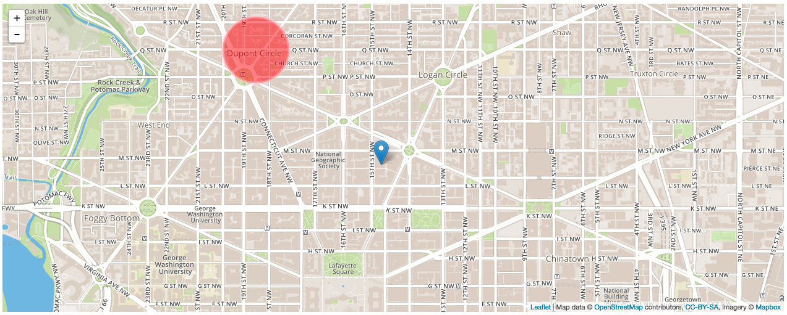

## Leaflet and Map APIs
* Examine the value of mapping in modern-day web development.
* Using the Leaflet JS library...
  * Create a map.
  * Add markers and shapes to a map.
  * Add pop-ups to a map.
  * Handle events on a map.
* Explain what geoJSON is and how Leaflet uses it.

## Why Are We Having A Class on Maps? (5 / 5)

It's no secret you can do some seriously cool stuff with maps online. Some examples...
* Design: [Map with Curved Lines](http://www.amcharts.com/demos/map-with-curved-lines/)
* Making a Difference: [Google's Project Sunroof](https://www.google.com/get/sunroof#a=112%20Stanley%20St%2C%20Redwood%20City%2C%20CA%2094062%2C%20USA&b=125&f=lease&np=18&p=1&sh=1)
* Adding Functionality: [Mapbox Showcase](https://www.mapbox.com/showcase/)
* Do you all have any examples?

We can do crazy, radically-different cool things with maps. But at the core of all these examples is geographical data.
* In its most basic form, latitude-longitude.
* While we're going to keep things simple today, soon enough you'll be able to work some crazy map wizardy with nothing more than geographical data and javascript.

## A History of Maps Online (5 / 10)

We haven't always had access to mapping data like we do now.

1996: Mapquest  
* Automatically-generated driving directions! Magic!
* Major consumer-facing use of mapping data.
* [Still in business...](http://www.mapquest.com/)

2005: Google Maps & API  
* Users can interact with a full-fledged map of the world.
* That same year, and perhaps most importantly for developers, Google released a Maps API.
  * Not only was there this massive trove of mapping data, but now developers could interact with it. On external websites, at that.
  * Motivated in part by other sites that reverse engineered Google Maps, like [Chicago Crime](http://www.holovaty.com/writing/chicagocrime.org-tribute/) and [Housing Maps](http://www.housingmaps.com/).
* The most heavily-used API on the web.

## What is Leaflet? (5 / 15)

> [Leaflet](http://leafletjs.com/) is the leading open-source JavaScript library for mobile-friendly interactive maps. Weighing just about 33 KB of JS, it has all the mapping features most developers ever need.

Leaflet is a Javascript library thats allows us to create and render interactive maps in the browser.
* Often used in tandem with [Mapbox](http://mapbox.com), a popular map provider that contributes a lot to open source mapping libraries.
  * Powered by OpenStreetMap, an open source map mapping database.
  * In turn, powers Foursquare, Uber and other major services.
  * They're also DC-based!
  * Mapbox.js now [incorporates Leaflet](https://www.mapbox.com/blog/mapbox-js-with-leaflet/).
* Allows us create the same type of objects you see in Google Maps (e.g., markers, routes, polygons).
* We can use Javascript events to add interactivity to a Leaflet map.

Why Leaflet?
* Intuitive, easy-to-use Javascript library.
* Lightweight, no-frills library.
  * Can add to functionality using [plug-ins](http://mapbbcode.org/leaflet.html).
* Cheaper. If your map application ends up making a lot of API requests, Leaflet / Mapbox is a cheaper alternative to Google Maps.
* Still, encourage you to check out the [Google Maps API](https://developers.google.com/maps/documentation/javascript/libraries).

## Setup (5 / 20)

### Quick Start

[Clone this repo.](https://github.com/ga-dc/mapping-inclass)
* Just contains some empty HTML, CSS and JS files.

### Link to the Leaflet stylesheet

```html
<!-- index.html -->

<head>
  <meta charset="UTF-8">
  <title>Fun with Mapz!</title>

  <!-- Leaflet stylesheet -->
  <link rel="stylesheet" href="http://cdnjs.cloudflare.com/ajax/libs/leaflet/0.7.3/leaflet.css" />

  <!-- Our stylesheet -->
  <link rel="stylesheet" href="style.css" />
</head>
```

### Link to Leaflet script file

```html
<body>
  <!-- Let's also create a container for our map -->
  <div id="map"></div>

  <!-- Leaflet script -->
  <script src="http://cdnjs.cloudflare.com/ajax/libs/leaflet/0.7.3/leaflet.js"></script>

  <!-- Our script -->
  <script src="app.js"></script>
</body>
```

### Add map styling

```css
/* style.css */

#map {
  height: 500px;    /* Let's give our map a height so we can see it. */
}
```

### Sign up for Mapbox / Leaflet (5 / 25)

[Sign up for an account at Mapbox](https://www.mapbox.com/)

#### Map ID
After creating an account, click "Projects" towards the right of the navbar. It may look like a folder icon without text.
* On the following screen, click "My First Map".
* Copy the value in the **Map ID** field. You'll need this later.

#### API Access Token
Then, click on your username/avatar in the navbar.
* In the new sub-navbar, click on "Apps."
* Copy the value to the right of **Default Public Token**. You'll also need this later.

## Create a Map

### An Empty Map (5 / 30)

```js
// app.js

var map = L.map('map').setView([38.9038829, -77.0360032], 15);
```

`L.map()`
* This method takes the ID of your map container as an argument. In this case, it's simply "map".

`.setView()`
* This method takes two arguments...
  1. An array containing the latitude and longitude coordinates of the center of your map.
  2. The starting zoom level of your map.

Need help getting coordinates? [Get some here](http://itouchmap.com/latlong.html)!

When your map declaration is set up, you should see something like this...


Technically, there is a map here.
* If we fed in some latitude-longitude coordinates and rendered a marker, it would appear.
* But an invisible map doesn't really help us. That's where tiling comes in.

### Add Tiling (5 / 35)

Our map won't do much good without tiling (i.e., the map itself). We can add tiling using Leaflet's `.tileLayer` method. Enter this below your `L.map().setView()` method.
* Make sure to fill in `id` and `accessToken` with the **Map ID** and **Default Public Token** values you saved earlier.

```js
L.tileLayer('https://api.tiles.mapbox.com/v4/{id}/{z}/{x}/{y}.png?access_token={accessToken}', {
    attribution: 'Map data &copy; <a href="http://openstreetmap.org">OpenStreetMap</a> contributors, <a href="http://creativecommons.org/licenses/by-sa/2.0/">CC-BY-SA</a>, Imagery © <a href="http://mapbox.com">Mapbox</a>',
    maxZoom: 18,

    // Replace the below properties with your `Map ID` and `Default Public Token` values you saved earlier, respectively.
    id: 'INSERT_MAP_ID_HERE',
    accessToken: 'INSERT_PUBLIC_TOKEN_HERE'
}).addTo(map);
```

You should see something like this...


**BOOM**, we've got a map! Now let's do something with it.

**Note:** The above tiling isn't the only one we can use.
* In fact, Mapbox isn't the only provider of Leaflet map tiling.
* Check out [this gist](https://gist.github.com/mourner/1804938), which contains tiling links for a number of different map tiles like `OpenCycleMap`.

## Map Markers (5 / 40)

Add a marker to your map using the `L.marker` method.
* Takes an array of latitude and longitude as an argument.
* Append with `.addTo( map )` to render.

```js
// `map` is the variable we originally saved our map to.
var generalAssembly = L.marker( [38.9048542, -77.0339403] ).addTo( map );
```

### You Do: Make Some Markers (10 / 50)

Make five markers!
* Use the same Leaflet syntax we just used in the class.
* **BUT**, you must use a loop or enumerator to create and render these markers.
* Use whatever container you want (e.g., array, object) to pass in coordinates to your loop.

**BONUS I:** Write a function that takes coordinates from a form and uses them to add markers to a map.

**BONUS II:** Write a function that generates coordinates from a place description (e.g., "The White House DC") using the [OpenCage Geocoder API](http://geocoder.opencagedata.com/demo.html). Then, add markers to your map using those coordinates.
* Use [this demo](http://geocoder.opencagedata.com/demo.html) to generate a sample URL.
* You can sign up for an API key [here](http://geocoder.opencagedata.com/api.html#quickstart). If you're having trouble, you can use mine.

## Shapes (5 / 55)

You can also use a circle to cover a portion of a map using `L.circle()` and `.addTo( map )`. Takes three arguments...
  1. Latitude/longitude array.
  2. Radius.
  3. Object with values for `color`, `fillColor` and `fillOpacity`.

```js
var dupontCircle = L.circle([38.9111048, -77.042613,15], 500, {
    color: 'pink',
    fillColor: 'red',
    fillOpacity: 0.5
}).addTo(map);
```

You should see something like this..



You can also use `L.polygon()` to highlight a particular portion of a map. It takes latitude/longitude arrays as arguments.
* Can you think of some useful applications of this feature?

```js
var washington = L.polygon([
    [38.934347, -77.119758],
    [38.995421, -77.041006],
    [38.892885, -76.909599],
    [38.791605, -77.038860]
]).addTo(map);
```

### You Do: Markers to Shapes (10 / 65)

Modify the previous exercise so that you are using a loop to generate a polygon.
* The five coordinates you entered earlier should now be the corners of a polygon.

**BONUSES I & II:** Try out the earlier bonuses if you haven't already and apply them to this exercise prompt.

## Break (10 / 75)

## Map Pop-Ups (5 / 80)

Say you look up a restaurant on Google Maps. When you click on its marker, you would expect to see some helpful information like address, operating hours, or something.
* Let's create a simple version of that using Leaflet's Pop-Up feature.
* We can call the `.bindPopup()` method on the marker we already made.
* If we want our pop-up to automatically render upon page load, we can append it with `.openPopup()`.

```js
// Our marker
var generalAssembly = L.marker( [38.9048542, -77.0339403] ).addTo( map );

// Create a pop-up.
generalAssembly.bindPopup(
  "<h3>General Assembly DC</h3><p>1133 15th St., NW</p><p>8th Floor</p><p>Washington, DC 20005</p>"
)
```

## Events (15 / 95)

Pop-ups are cool, but they're not enough. We want to be able to interact with our map and make use of the information that comes with it. **Enter events!**  
* The great thing about Leaflet events is that we can use the Javascript skills we learned at the start of WDI.

Every event in Leaflet returns an event object that contains information about that event.
* Let's see what we get back after setting up a simple click event listener.

```js
//
map.on( "click", function( event ){
  console.log( event );
})
```

Let's look at that event response in the console. What do you see in there?


That event response is ours for the taking. We can do whatever we want with that information.
* Let's try something simple: creating a new pop-up that displays the latitude and longitude of where we clicked.

```js
// Need to define the popup that will appear after a click.
var clickPopup = L.popup();

// Now define when and how `clickPopup` will appear.
map.on( "click", function( event ){
  clickPopup
  .setLatLng( event.latlng )
  .setContent( "Coordinates: " + event.latlng.toString() )
  .openOn( map );
})
```

Check out Leaflet's [event documentation](http://leafletjs.com/reference.html#events) if you want to learn more.

### Exercise: Click = Marker + Pop-Up (10)

Create an event listener that adds a marker to the map wherever the user clicks.
* That marker should also have a pop-up that displays the latitude-longitude for that location.

## GeoJSON

### What is GeoJSON?

> [GeoJSON](http://geojson.org/geojson-spec.html) is a format for encoding a variety of geographic data structures. A GeoJSON object may represent a geometry, a feature, or a collection of features. GeoJSON supports the following geometry types: Point, LineString, Polygon, MultiPoint, MultiLineString, MultiPolygon, and GeometryCollection. Features in GeoJSON contain a geometry object and additional properties, and a feature collection represents a list of features.

GeoJSON is essentially a JSON object that contains a variety of information about a point or area (or a collection of the two) on a map.
* With Leaflet, rather than hardcode information about a marker, circle or polygon into our code, we can import that geographical information using GeoJSON.

### GeoJSON Components (10 / 115)

All GeoJSON objects must have a `type` value, which can equal a Geometry type, "Feature" or "FeatureCollection".
* Geometry types
  * `Point`
  * `MultiPoint`
  * `LineString`
  * `MultiLineString`
  * `Polygon`
  * `MultiPolygon`
  * `GeometryCollection`
* Feature
  * What you'll probably use most of the time.
  * Can make use of the above geometry types.
  * More importantly, allows us to add custom properties about our geographical information (e.g., location name, pop-up display content).
* Feature Collection
  * A collection of features. These are stored in a `features` property, which is an array of feature objects.

Below is an example GeoJSON "feature".
* **FYI:** The [GeoJSON documentation](http://geojson.org/geojson-spec.html) is a great first place to look if you have any questions about syntax.
* **Also FYI:** GeoJSON coordinates are written in the order of longitude then latitude.
  * Google Maps, for example, lists them in the reverse order, so keep that in mind when pulling coordinates from elsewhere.

```js
// We're saving a GeoJSON object to a variable.
var monumentTrail = {
  "type": "Feature",

  // Can set "properties" to whatever we want.
  "properties": {
    "name": "Monuments Trail",
    "city": "Washington, DC",
    "numStops": 5
  },

  // Set geometry type here.
  "geometry": {
    "type": "MultiLineString",
    "coordinates": [
      [[-77.0352791,38.8894838], [-77.050176,38.8892686]],
      [[-77.050176,38.8892686], [-77.0364707,38.8813726]],
      [[-77.0364707,38.8813726], [-77.0090505,38.8899389]]
    ]
  }
}
```

Then we render the GeoJson...

```js
L.geoJson( monumentTrail ).addTo( map );
```

And we should see something like this...


**Fun Fact:** GitHub has GeoJSON support.
* If you save a `.geojson` file in a repo, Github uses Leaflet to render that data in the browser.
* [Here's our earlier monuments example](https://gist.github.com/amaseda/e6abab0e337098a036ba).
* More info [here](https://help.github.com/articles/mapping-geojson-files-on-github/).

## Exercise: Using GeoJSON (10 / 125)

Use a "Feature Collection" to recreate the markers and polygons you created in the first two Marker and Polygon exercises.
* What exactly is a Feature Collection? An array of features.
* Need help? Leaflet's [GeoJSON documentation](http://leafletjs.com/examples/geojson.html) will start you on the right path.

## Break (10 / 135)

## Homework: [Trip Planner](https://github.com/ga-dc/plannr)

## Sample Quiz Questions

## Additional Reading
* [Disabling Map Zooming an Panning](https://www.mapbox.com/mapbox.js/example/v1.0.0/disable-zooming-panning/)
