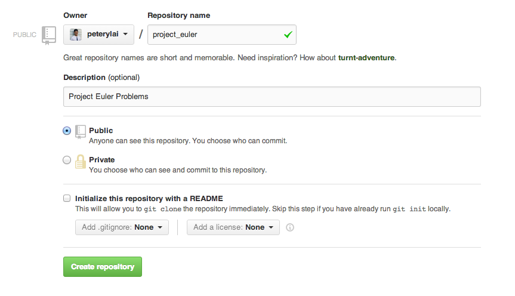

# Github Repo Setup

### Step 1
####Go to Github and start a new repository


### Step 2
####Fill out the information about your new repository and create it



### Step 3
####On your local machine, in your `dev` directory, create a new directory called `project_euler` and navigate into that direcotry.

#####Once you are in `~/dev/project_euler/` follow the instructions from Github. Can you figure out what each command is doing?


# Project Euler

### Register & Setup
* If you [register](http://projecteuler.net/register) you'll be able to submit answers to check if they are correct.

### Project Euler Problem 1

Begin by tackling [Problem 1](http://projecteuler.net/problem=1). TDD not required.

```
If we list all the natural numbers below 10 that are multiples of 3 or 5, we get 3, 5, 6 and 9. The sum of these multiples is 23.

Find the sum of all the multiples of 3 or 5 below 1000.
```

### Bonus
* Refactor your code so that you can dynamically enter the max value and the two multiples you want so we aren't hard coded into using 1000, 3 and 5
* Can you do it without using loops or enumeration?