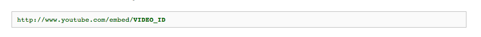
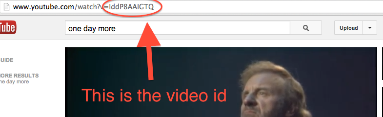

#MovieTrail.er

We're going to build an app to keep track of our favorite movies, look at photos of characters in that movie, and watch the trailers that came out for that movie.

A Movie has:

* title
* year
* poster_url

A Character has:

* name
* photo_url

A Trailer has:

* title
* embed_url

NOTE: Check out [how to embed a youtube video](https://developers.google.com/youtube/player_parameters#Embedding_a_Player)

Here's what the url looks like:

Here's here you find the video_id:

## Part 1 - Database
* Start by setting up your database schema and creating your database. Test it to make sure it works!

## Part 2 - Models & ActiveRecord
* Set up your models using ActiveRecord. Test them to make sure they work and they are associated correctly.

* Add ActiveRecord Validations to make sure that all of the titles for the movies are both present and unique.

* Create AT LEAST 3 movies with 2 characters and 1 trailer each so you have a good amount of data to start with. You can / should do this using your seeds file.

## Part 3 - Routes, Controllers & Views
* Build out your Rails app one route at a time. Make sure to test it before moving on to the next route. You should have controller actions for index, new, create, show, update and destroy.

## Bonus
* Add CSS to make your app look nice
* Figure out how to deploy your app to Heroku
* Implement a "Search" feature where users can enter a movie title into a form and they are displayed the "show page" for that movie if it exists.
