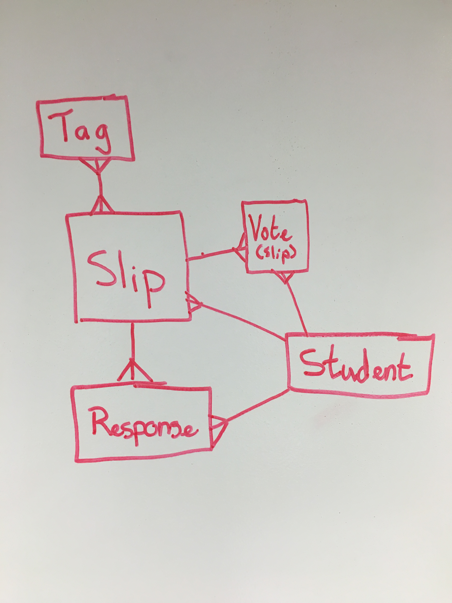

# Modeling One-To-Many Relationships with NoSQL DBs: It's Complicated

This lesson is an overview of the first topics presented in more detail in [this post from the mongoDB blog](http://blog.mongodb.org/post/87200945828/6-rules-of-thumb-for-mongodb-schema-design-part-1). Definitely bookmark that post — it comes in handy frequently.

Especially when coming from experience with relational databases, we have a hard time understanding document relations in NoSQL databases. This is because the question "how do I model relationships in MongoDB?" doesn't have one answer (not to be confused with no answer) there are many! With many options, there are many considerations to be made as how  to best model our data to serve our needs.

As we consider the next few examples and the ways to structure relationships, consider this ERD for a database which manages Slips:



### TPS - 5 min

Discuss ERD - what do we want out of our data? How would we model this in PostgreSQL?


## Three Basic Ways to Model Data

William Zola (Lead Technical Support Engineer at MongoDB — wrote the post this lesson is based on) talks about One-to-N (common name for one-to-many) not being specific enough to discribe relationships in MongoDB. We need to break One-to-N into 3 categories: __One-to-Few__, __One-to-Many__, and __One-to-Squillions__.

### TPS - 5 min

What does not specific enough mean? What kind of choices might we be making depending on which category the relationship belongs?

### One-to-Few

``` js
> db.person.findOne()
{
  name: 'Kate Monster',
  ssn: '123-456-7890',
  addresses : [
     { street: '123 Sesame St', city: 'Anytown', cc: 'USA' },
     { street: '123 Avenue Q', city: 'New York', cc: 'USA' }
  ]
}
```


The first type of relationship we learn about studying mongo is the nested document. This is neat since it is something we specifically could not do in a relational database but it is neither without disadvantages nor our only means of relating documents.

The primary disadvantage is that we cannot access these sub-documents without going though the parent document. This is fine for something like addresses in our example because there are likely few situations where an addresses has any signifiance outside of the context of the resident.

However, for something like students and assignments — even if there are relatively few assignments — we may want to consider assignments independent of specific students to look at class metrics. It would be inconvinient here to need to access assignments by first going through all the students and then assembling all assignments.

### One-to-Many

```
> db.parts.findOne()
{
    _id : ObjectID('AAAA'),
    partno : '123-aff-456',
    name : '#4 grommet',
    qty: 94,
    cost: 0.94,
    price: 3.99
}
```

```
> db.products.findOne()
{
    name : 'left-handed smoke shifter',
    manufacturer : 'Acme Corp',
    catalog_number: 1234,
    parts : [     // array of references to Part documents
        ObjectID('AAAA'),    // reference to the #4 grommet above
        ObjectID('F17C'),    // reference to a different Part
        ObjectID('D2AA'),
        // etc
    ]
```

> For efficient operation, you’d need to have an index on ‘products.catalog_number’. Note that there will always be an index on ‘parts._id’, so that query will always be efficient.

```
 // Fetch the Product document identified by this catalog number
> product = db.products.findOne({catalog_number: 1234});
   // Fetch all the Parts that are linked to this Product
> product_parts = db.parts.find({_id: { $in : product.parts } } ).toArray() ;
```

We can reference foreign ids just the same in Mongo as we did with PostgreSQL. Notice in the example here the parts table is searched explicitly for the ids in the product.parts array — this is like what ActiveRecord was doing for us under the hood. Mongoose provides tools for automating this as well.

Referencing has the opposite advantages and disadvantages from embedding. Referenced documents stand alone in their own collection and are easier to search and modify however getting a subcollection takes two queries. Interestingly — because we have any array of references — trying to design a One-to-N relationship, we have a design which also accomidates N-to-N relationships. That's pretty neat!

### One-to-Squillions

<script src="https://gist.github.com/amyberman3/49a287d19027258dd3ac.js"></script>

<script src="https://gist.github.com/amyberman3/0a4dc052d48196baa924.js"></script>

Document sizes are limited to 16 MB and in cases such a message logging where there are enormous numbers of relationships. A parent document describing a host could not hold an array large enough to reference all of the related log documents. Instead, the log documents simply reference a host document. To get the most recent 5000 logs for a particular host we just search the log collection chronologically for a particular id.

### TPS (10 min)

Think of examples of these One-to-* cases and write one (or more) for each. After 3 minutes, pair and discuss ideas. Justify decisions and aknowledge situations where your model would not be ideal.

### Review

We are considering two things when we model relationships in mongo:

> Will the entities on the “N” side of the One-to-N ever need to stand alone?

>

> What is the cardinality of the relationship: is it one-to-few; one-to-many; or one-to-squillions?

## Further Reading: Intermediate Techniques: Bi-directional Referencing and Denormalization

As we have discussed — there are definate limitations to all of our basic techniques for modeling relationships. We can use more sophisticated techniques to work around some of these limitations. These techniques too have advantages and disadvantages so we must be very considerate of the perticulars of our problem when choosing which techniques to employ.

[Intermediate Mongo Techniques](http://blog.mongodb.org/post/87892923503/6-rules-of-thumb-for-mongodb-schema-design-part-2)

